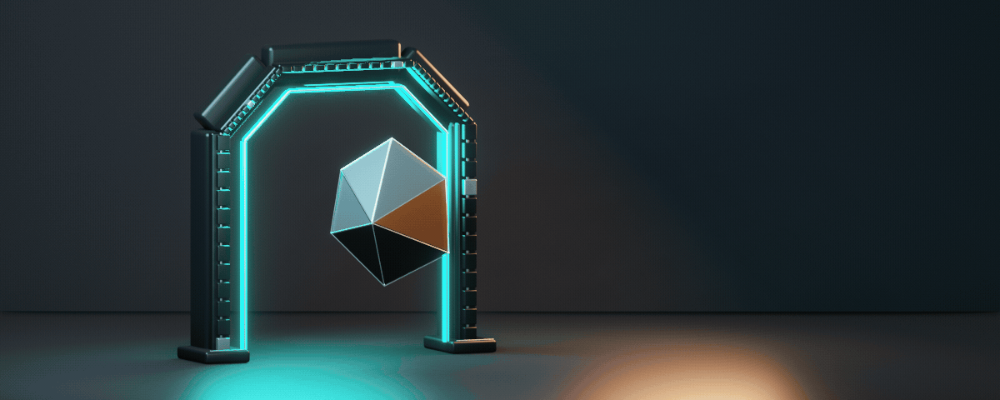
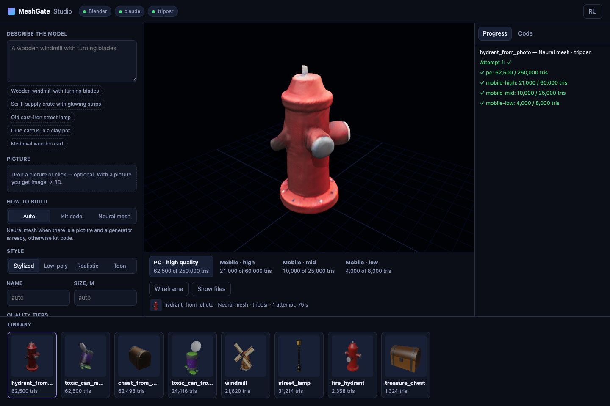
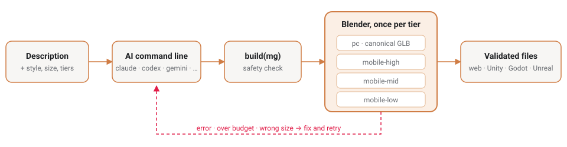
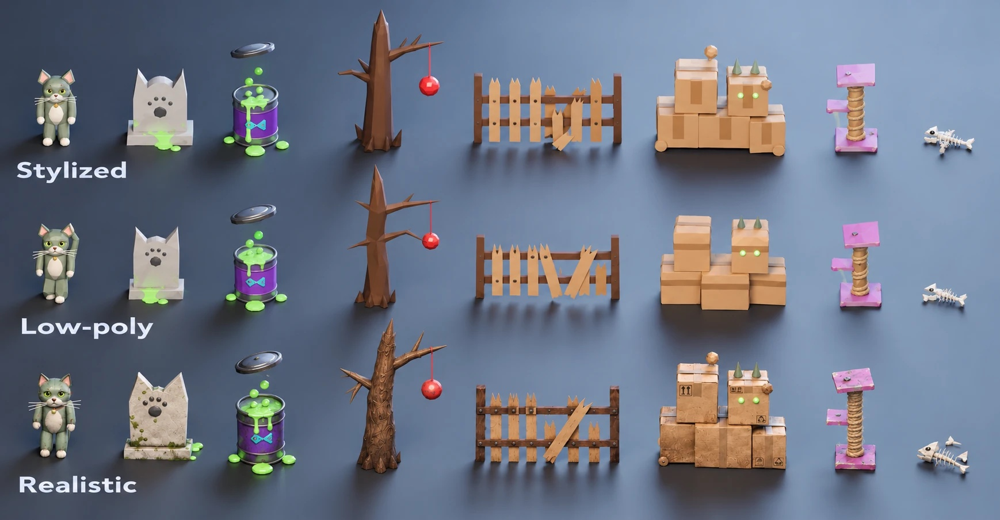
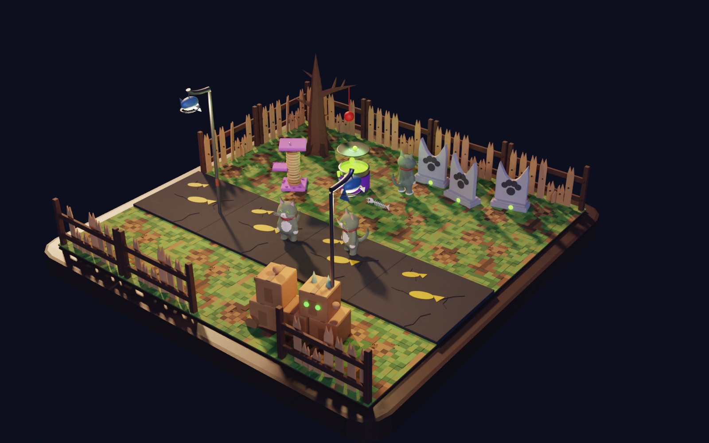
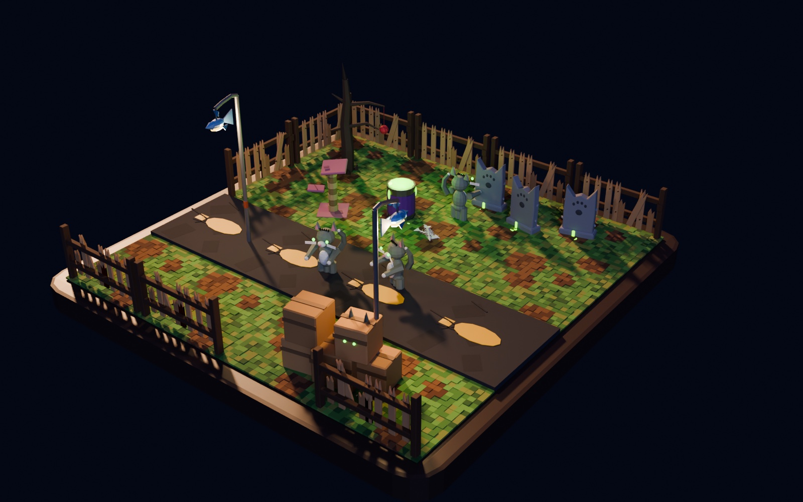
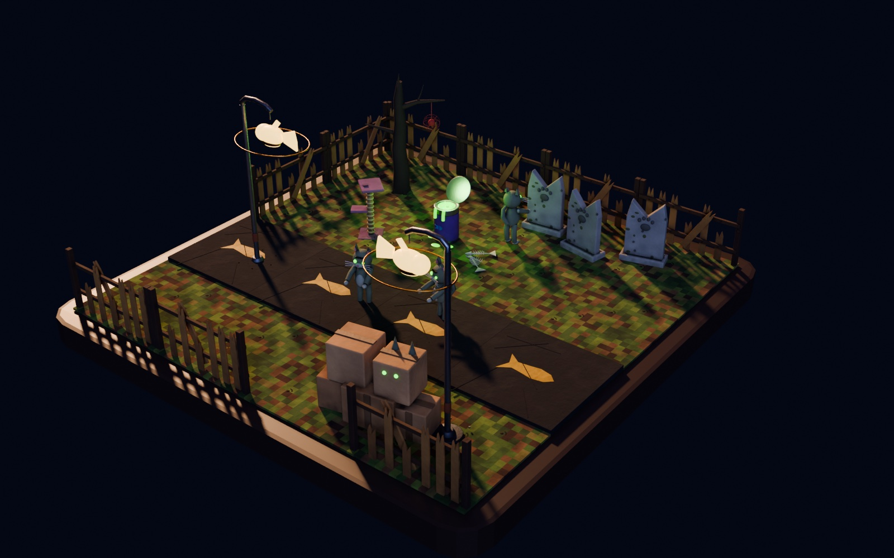

**English** · [Русский](README.ru.md)

# MeshGate

> Make a game-ready 3D model from a description or a picture — or bring your own from Blender — and get checked files
> for the web, Unity, Godot and Unreal, one per quality level.



## What it does

- **Text → 3D.** Describe the model. An AI tool you already use (Claude Code, Codex, Gemini or Ollama) writes a short
  program that builds it from simple parts, and Blender builds it.
- **Picture → 3D.** Drop a picture. TripoSR on your computer, or a cloud generator, turns it into a mesh; MeshGate
  stands it upright, simplifies it and bakes its colours.
- **Your own models.** The Blender add-on checks a model, fixes what engines trip over and exports it.
- **Ready for every device.** Each model is built for four quality tiers — PC, mobile high, mobile mid, mobile low —
  within each tier's triangle and texture budget, as `.glb` plus `.fbx` and engine variants with collision and LODs.
  Every file is checked against the engines' rules before you see it.
- **Three styles that really differ:** stylized, low-poly (faceted, several times lighter) and realistic (dirt, colour
  variation and relief baked into textures).

Everything runs on your computer. Documentation is in English and Russian: every page has a language switcher.

## Download

| System | File from [Releases](https://github.com/MaverickGH/meshgate/releases) |
|---|---|
| macOS (Apple Silicon) | `MeshGate.Studio_<version>_aarch64.dmg` |
| Windows 10/11 | `MeshGate.Studio_<version>_x64-setup.exe` (or `.msi`) |
| Linux, or any system without installing | `MeshGate-<version>-portable.zip`, then `python3 meshgate.py studio` |

The builds are not signed yet: on macOS right-click the app → **Open** the first time; on Windows choose **More info →
Run anyway**.

## Install in five steps

1. **MeshGate Studio** — from the table above.
2. **Python 3.9+** — usually already there; if the app says it is missing, install it from
   [python.org](https://www.python.org/downloads/).
3. **Blender 3.5+** from [blender.org](https://www.blender.org/download/). Then in Studio: **Status & AI** → Blender →
   **Install add-on**.
4. **An AI tool** for text → 3D: **Status & AI** → Claude Code, Codex or Gemini → **Install** → **Sign in**. A
   subscription sign-in is enough.
5. **TripoSR** for picture → 3D: **Status & AI** → Optional components → TripoSR → **Install** (~3 GB, free).

**Status & AI** shows at any time what was found and what is missing. Every option, every system and the engine
plugins: **[Installation](docs/install.md)**.

## Your first model

1. Type a description — "a rusty street lamp with a fish-shaped lantern" — or drop a picture.
2. Pick a style: **Stylized**, **Low-poly** or **Realistic**.
3. Optional: **Output settings** for the size, the tiers, your own triangle limits and textures or vertex colours;
   **Animations** to describe clips such as "open: the lid opens".
4. Press **Generate**. In one to three minutes every tier appears in 3D with its triangle count.
5. **Show files** opens the folder with the `.glb`, `.fbx` and engine files.



## How it works



The AI writes code against MeshGate's modeling kit, or a neural network makes a mesh. Blender, in the background,
builds the model once per tier, and every file goes through the validator: size in meters, axes, materials, names,
the tier's budget and what each engine needs. Anything wrong goes back to the AI with its code, up to three times.
Details: [Generation](docs/generation.md) and the [asset contract](docs/asset-contract.md).

## Use the files in your engine

| Engine | Plugin | Which file |
|---|---|---|
| Web (Three.js) | none — [`meshgate-viewer.js`](targets/web/README.md) picks the tier by device | `<name>.glb` and `<name>.<tier>.glb` |
| Unity 6 | glTFast + [`com.meshgate.unity`](targets/unity/README.md) | `.glb` at runtime; `.fbx` for Humanoid; `.unity.fbx` with LODs |
| Godot 4.4+ | the [`meshgate`](targets/godot/README.md) add-on | `.glb`; `.godot.glb` with collision |
| Unreal 5.4–5.6 | the [`MeshGate`](targets/unreal/README.md) plugin | `.glb` through Interchange; `.unreal.fbx` with `UCX_` collision |

Web, Unity and Godot have automated checks that load every sample and generated asset (`meshgate.py check`); Unreal
is checked against its Python API, a live editor run is next. Recommendations per engine: [Getting started](docs/getting-started.md#6-recommendations-per-target).

## Example: Zombie Cats in three styles



*Concept art — the target look for the pack (our render, reworked with an image model). What MeshGate generates
today is below.*

Eleven assets, generated by MeshGate once per style from one description each and a reference picture. The realistic
ones get their surfaces from the bake: wood grain, corrugated cardboard, mossy stone, rope, rusting metal. Every file
fits every tier's budget, and the build code is in the repository, so `python3 sources/generate/make_style_packs.py`
rebuilds all three packs without an AI. **Coming later:** the realistic zombie cat and fish bones — organic shapes
that need a picture → 3D generator ([planned](sources/generate/examples/zombie_cats/planned.json)).

**Generated by MeshGate today:**


| Stylized | Low-poly | Realistic |
|---|---|---|
|  |  |  |

The hand-built original, with a rigged Humanoid cat and collision variants, checked in Unity and Godot:
[`samples/packs/zombie_cats`](samples/packs/zombie_cats/README.md).

## In Blender, without Studio

Install the add-on (**Status & AI** → **Install add-on**, or `python3 meshgate.py install-blender` with Blender
closed), then press **N** → **MeshGate**: tick the engines and tiers, **Check**, **Fix all**, **Export**. It writes a
validated GLB plus FBX, collision for Unreal and Godot and LOD meshes for Unity, and opens the result in the browser.
See [sources/blender/README.md](sources/blender/README.md).

## Command line

The same without a window, and in CI:

```bash
python3 meshgate.py doctor                                    # what is installed and what is missing
python3 meshgate.py gen "a wooden treasure chest" --size 0.8  # text → model for every tier
python3 meshgate.py gen --image photo.jpg --size 0.8          # picture → model
python3 meshgate.py studio                                    # MeshGate Studio in your browser
python3 meshgate.py export scene.blend --out build/asset.glb --fbx   # Blender file → checked GLB (+ FBX)
python3 meshgate.py validate build/asset.glb --strict         # check any GLB or FBX
python3 meshgate.py serve --glb build/asset.glb               # view it in the web viewer
python3 meshgate.py install-blender                           # install the Blender add-on
python3 meshgate.py check all                                 # every automated check: web, Blender, Unity, Godot, Unreal
```

`gen` options — style, triangle limits, vertex colours, animations, concept pictures — are in
[docs/generation.md](docs/generation.md). Tools are found automatically; `MESHGATE_BLENDER`, `MESHGATE_UNITY`,
`MESHGATE_GODOT` and `MESHGATE_UNREAL` point to others.

## Documentation

| Page | What is in it |
|---|---|
| [Installation](docs/install.md) | Every step for macOS, Windows and Linux, what each part needs, where files are kept |
| [Getting started](docs/getting-started.md) | From install to a model in your engine; recommendations per engine; troubleshooting |
| [Generation](docs/generation.md) | Text and picture → 3D, styles, limits, colours, animations, AI tools, generators |
| [MeshGate Studio](apps/studio/README.md) | The app: every panel and setting |
| [Quality tiers](docs/quality-tiers.md) | Budgets and render settings for PC and three mobile tiers |
| [Asset contract](docs/asset-contract.md) | The rules every file follows, and what the validator checks |
| [Architecture](docs/architecture.md) | Why glTF, how sources and engines plug in |
| [Roadmap](docs/roadmap.md) | What is done and what comes next |

For AI coding agents, [`SKILL.md`](SKILL.md) turns the pipeline into a repeatable skill (`python3 scripts/install_skill.py`).

<details>
<summary>Repository layout</summary>

```
meshgate.py      the command line: doctor, gen, studio, export, validate, serve, check, install-blender, …
core/            asset contract, quality tiers, GLB and FBX validators (standard library only)
sources/blender  the Blender add-on, the modeling kit, headless export, demo generators
sources/generate text and picture → model: prompts, AI tool adapters, guard rails, generators, refine, examples
sources/maya     planned second source (v0.7)
apps/studio      MeshGate Studio: local server and interface, Tauri desktop app for macOS and Windows
targets/         web viewer, Unity package, Godot add-on, Unreal plugin
samples/         demo assets and the Zombie Cats and Generated packs
docs/            documentation (English and Russian)
tests/           automated checks; .github/ runs them on Linux and Windows and builds the installers
```

</details>

## Status

**v0.6.6.** Generation from text and pictures, three styles, four quality tiers, MeshGate Studio for macOS, Windows
and Linux (portable). Checked on Blender 3.5, 4.2 LTS and 5.2 LTS, Unity 6, Godot 4.7 and in the web viewer; for every change
GitHub runs the web, Blender, Godot and Unreal API checks on Linux, and the web and Blender checks on Windows. Next: a live Unreal run, characters with a skeleton, animation from text (Kimodo), Maya, signed
installers — see the [roadmap](docs/roadmap.md).

## License

Proprietary — all rights reserved, see [LICENSE](LICENSE). You may use official releases and ship games made with
the plugins; the models you make are yours. Copying, sharing or modifying the code needs written permission.
Third-party components keep their own licenses: [THIRD_PARTY_NOTICES.md](THIRD_PARTY_NOTICES.md).
