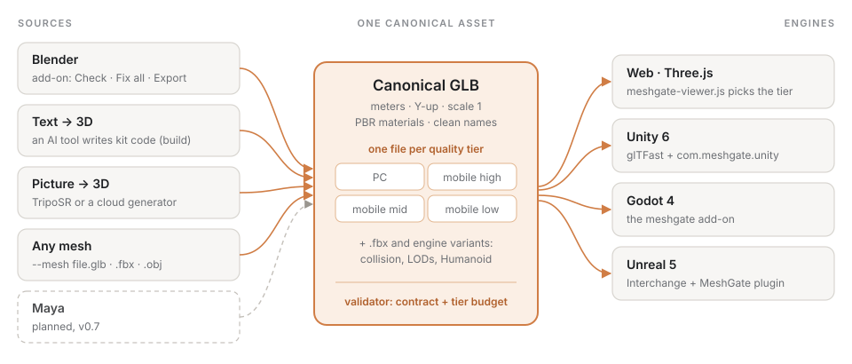

**English** · [Русский](architecture.ru.md)

# MeshGate architecture — "hub and spokes"

**The core** is a canonical glTF 2.0 (GLB) per the asset contract + a validator. The core
knows nothing about any specific editor or any specific engine.

**Sources (spokes-in)** bring the asset to the canonical GLB:
- Blender — native glTF export with contract presets.
- Maya — no glTF out of the box: the path goes through a plugin (Maya2glTF/Babylon) or through FBX/USD → conversion to GLB.

**Targets (spokes-out)** accept the canonical GLB:
- Web — Three.js `GLTFLoader`.
- Unity — glTFast (MIT).
- Godot — native glTF import (the engine's preferred format).
- Unreal — native glTF importer / Interchange.

## Fallback path: FBX / USD
The web lives on glTF, but for Maya-originated assets and heavy rigs/large scenes, engines
sometimes need a native format:
- **FBX** — the de facto DCC↔engine standard (native in Maya, available in Blender, imported by all engines; Godot converts it to glTF).
- **USD** — the studio scene interchange format (native in Maya and Unreal, evolving in Blender/Unity).
MeshGate lets FBX/USD pass "straight through" for such cases, but the canon for web + real-time is glTF.

## Adding a new source/target
A new editor = an adapter in `sources/` that outputs a GLB per the contract.
A new engine = an adapter in `targets/` that imports the canonical GLB and wires up interaction.
The core and the contract do not change.
