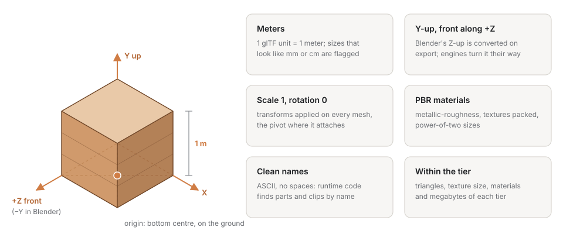

[English](asset-contract.md) · **Русский**

# Контракт ассета MeshGate

Единые правила, при которых один GLB предсказуемо открывается в вебе и во всех
движках. Валидатор (`core/validate_glb.py`) проверяет то, что видно из файла;
остальное — соглашения на стороне экспорта.

## Геометрия и трансформы
- **Единицы — метры.** 1 юнит glTF = 1 метр. В Blender сцена в метрах, в Maya — выставить рабочие единицы в метры перед экспортом.
- **Оси.** glTF — Y-up, правосторонняя. Экспортёр Blender конвертирует из Z-up; в Maya (Y-up) конвертация не нужна. Итог всегда Y-up.
- **Применённые трансформы.** Масштаб = 1, поворот = 0 на объектах (apply transforms), иначе в движке всплывают неожиданные повороты/масштабы.
- **Origin осмысленный.** Точка опоры там, где ассет будет «крепиться» (низ для предметов на полу, центр для вращаемых).

## Материалы
- **Только PBR.** Principled BSDF (Blender) / Standard Surface → glTF `pbrMetallicRoughness`. Экзотические ноды не переносятся — запекать в текстуры.
- **Прозрачность** — только вырез (`alphaMode: MASK`) и только там, где она заменяет геометрию: карточки волос и
  шерсти, листья, трава. Смешанная прозрачность плохо сортируется во всех движках, её избегаем; стекло — непрозрачный оттенок.
- **Текстуры** упакованы в GLB или лежат рядом; размеры — степени двойки (1024/2048), формат по возможности WebP/PNG.

## Именование
- Объекты и материалы — понятные латинские имена без пробелов (`handle`, `body_metal`), потому что по ним адресуются из кода рантайма.

## Оптимизация
- **Draco** для тяжёлой геометрии (сжатие в разы), если целевой рантайм умеет (Three.js, glTFast, Godot умеют; Unreal — проверять).
- **Лимит размера** по умолчанию 25 МБ на ассет — иначе долгая загрузка в вебе. Настраивается `--max-mb`.

## Риг и скин
- **Кости — по именам Unity Humanoid** (`Hips, Spine, Chest, Neck, Head, Left/RightShoulder, Left/RightUpperArm, Left/RightLowerArm, Left/RightHand, Left/RightUpperLeg, Left/RightLowerLeg, Left/RightFoot, Left/RightToes`). Mixamo-, Rigify- и UE-имена валидатор тоже распознаёт, но канон — Unity: тогда FBX импортируется как Humanoid-аватар без ручного маппинга, а клипы ретаргетятся между персонажами.
- **T-поза** в rest-позиции, до 4 влияний на вершину, веса нормированы (сумма 1), у скина есть `inverseBindMatrices`.
- **UV у всех вершин** скин-меша — иначе текстуры и запекание в движках не лягут.

## Анимации
- Skeletal/vertex-анимации переносятся через glTF. Сложные риги из Maya, если ломаются в glTF, — запасной путь FBX/USD (см. `architecture.md`).

## FBX как запасной путь
Тот же экспорт (`--fbx`) даёт FBX для редакторов движков и ригов: метры (`UnitScaleFactor = 100`), `-Z forward / Y up`, масштаб 1, take на каждый NLA-стрип, встроенные текстуры. Из контракта в FBX **не переносятся**: metallic/roughness-карты (только коэффициенты), прозрачность, `KHR_*`-расширения. Поэтому FBX — не канон, а спутник GLB для редакторского импорта; рантайм и веб — только GLB. Проверка — `core/validate_fbx.py` (единицы, оси, модели, take, встроенные текстуры, масштаб).

## Коллизии и LOD (для движков)
В каноническом GLB только то, что рендерится. Прокси коллизий и LOD-меши живут в исходной сцене как скрытые от рендера меши («Добавить коллизию» / «Сделать LOD» в аддоне Blender) и попадают только в тот вариант для движка, который их понимает:
- Unreal — `<name>.unreal.fbx` с выпуклыми мешами `UCX_<Mesh>_NN`, дочерними к своему рендер-мешу;
- Godot — `<name>.godot.glb` с нодами `<меш>…-convcolonly` (подсказка импорта Godot → StaticBody3D + выпуклая форма);
- Unity — `<name>.unity.fbx` с соседями `<меш>_LOD0.._LODn` (Unity собирает LODGroup); Unreal и Godot строят LOD сами.
Прокси коллизии должен быть выпуклым (UE ограничивает оболочки; меньше граней — дешевле) и иметь UV-развёртку, чтобы валидаторы не ругались.

## Проверка
Свежий импорт GLB обратно в редактор + `core/validate_glb.py` + визуальная проверка во вьюере `targets/web`.

Что именно проверяет валидатор (✗ — ошибка, ⚠ — предупреждение, `--strict` превращает ⚠ в ✗):

| Правило | Проверка |
|---|---|
| Контейнер | ✗ сигнатура/версия GLB, длина файла, JSON-чанк; `asset.version == 2.0` |
| Сцена | ✗ нет сцен / нет мешей; ⚠ не задана сцена по умолчанию |
| Метры | ⚠ мировой габарит < 1 см (похоже на мм) или > 100 м (похоже на см или это сцена) |
| Origin | заметка, если низ ассета заметно ниже origin |
| Трансформы | ⚠ масштаб ≠ 1 у нод с мешами; заметка о нодах с `matrix` (не анимируются) |
| Геометрия | ⚠ нет `TEXCOORD_0` (UV), нет `NORMAL`, примитивы не треугольники; треугольники считаются отрисованные — меш, который показывают несколько узлов (инстансы), считается за каждый узел, а в файле хранится один раз |
| Материалы | ⚠ нет материалов; материалы без `pbrMetallicRoughness` (и не unlit) |
| Риг | ⚠ скин без `inverseBindMatrices`, вершины без весов или с суммой ≠ 1, неполный JOINTS/WEIGHTS; заметка: Humanoid-совместимость (какие кости найдены/не хватает) |
| Текстуры | ⚠ внешние файлы (не упакованы), не степень двойки, больше 4096 |
| Имена | ⚠ ноды без имени; имена нод/материалов с пробелами или не-латиницей; анимации без имён |
| Расширения | ✗ обязательное расширение вне списка поддерживаемых; ⚠ неизвестное; заметки по целям (Draco → нет в Unreal Interchange, meshopt → только web/Unity) |
| Размер | ⚠ больше `--max-mb` (по умолчанию 25) |

Что валидатор проверить **не может** (не видно из файла): Y-up и метры как таковые — только косвенно по габаритам; чистоту топологии; качество UV-развёртки. Это зона экспортёра и автодоводки (roadmap v0.5).
