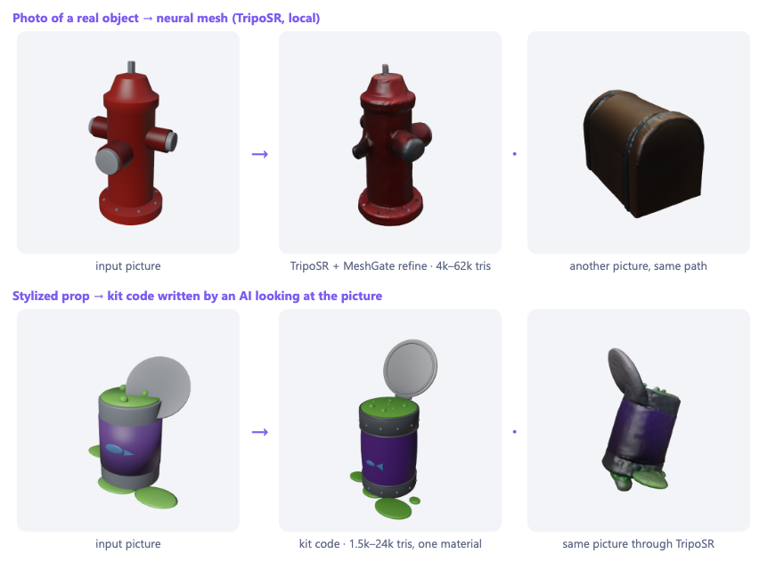
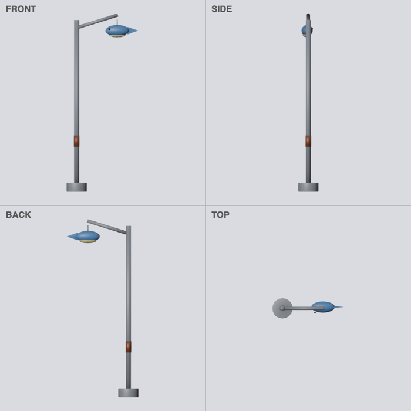
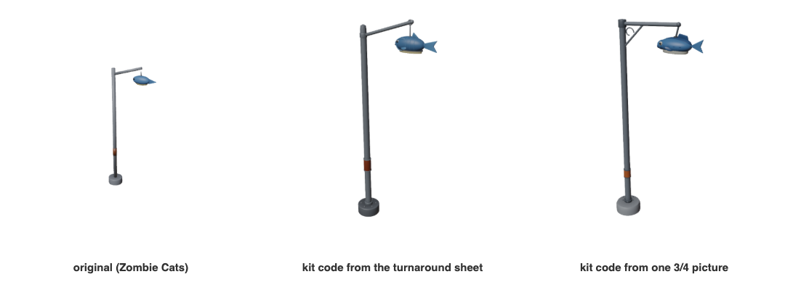
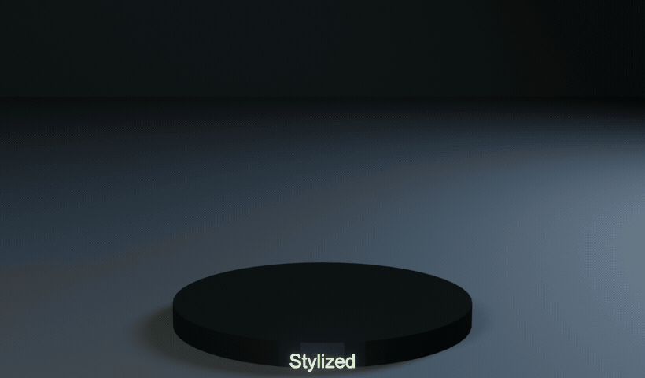

**English** · [Русский](generation.ru.md)

# Generation: text or picture → game-ready asset

`meshgate.py gen` turns a description, a picture or both into a validated asset, with one file per quality tier.
[MeshGate Studio](../apps/studio/README.md) is the same thing with a window.

There are two engines. Both end in the same place: files that pass the asset contract and each tier's budget.

| Engine | How the shape is made | Best for |
|---|---|---|
| **kit** | An AI command-line tool (Claude Code, Codex, Gemini, Ollama, your own) writes a short `build(mg)` function against MeshGate's modeling kit. A picture, if given, is its guide. | Hard-surface and stylized props: clean shapes, one material, editable code |
| **mesh** | A neural generator makes the mesh from a picture or text: TripoSR locally, or Meshy, Tripo, TRELLIS or Hunyuan3D in the cloud. MeshGate refines it for every tier. | Photos of real objects, organic shapes, anything the kit cannot describe |

With `--engine auto` (the default), a picture goes to the mesh engine when a generator is ready, and a description
goes to the kit engine.

```bash
python3 meshgate.py gen --list-ai                                    # AI CLIs, mesh generators, Blender
python3 meshgate.py gen "a cast-iron fire hydrant" --size 0.8        # text → kit code (Claude Code by default)
python3 meshgate.py gen --setup triposr                              # one time: local image → 3D (MIT, ~3 GB)
python3 meshgate.py gen --image photo.jpg --size 0.8                 # picture → TripoSR → refine
python3 meshgate.py gen --image photo.jpg --engine kit               # picture → kit code, the AI looks at it
python3 meshgate.py gen "a rusty robot" --engine mesh --provider meshy   # text → cloud mesh (MESHY_API_KEY)
python3 meshgate.py gen --mesh downloaded.glb --size 1.5             # any mesh → contract, no generation
python3 meshgate.py gen --code my_model.py --name my_model           # your own build(mg), no AI
```

The result lands in `out/gen/<name>/`:

| File | What it is |
|---|---|
| `<name>.glb` | Canonical asset, built at the richest tier you asked for |
| `<name>.<tier>.glb` | The same model at each lighter tier's own detail |
| `<name>.fbx`, `.unreal.fbx`, `.godot.glb` | Engine variants, the same as the add-on writes |
| `<name>.blend`, `<name>.png` | Blender scene and a preview render |
| `<name>.py` | Kit engine: the build code that produced it — rerun, edit, commit |
| `input.png`, `raw_<provider>.glb` | Mesh engine: your picture and the generator's untouched output |
| `gen.json`, `<name>.report.json` | Summary for Studio and CI: triangles, budgets, clips, problems |



## Kit engine: code written by an AI


1. **Prompt.** MeshGate fills [`sources/generate/prompts/model.md`](../sources/generate/prompts/model.md) with the
   description, the style, the quality tiers from [`core/profiles.json`](../core/profiles.json) and the API of the
   modeling kit. The API is read from the kit's docstrings, so the prompt cannot drift from the code. With a picture,
   the prompt gains a section that tells the AI to match its silhouette, parts and colours.
2. **Code, not meshes.** The AI answers with one `build(mg)` function written against the kit in
   [`meshgate_blender/modeling.py`](../sources/blender/meshgate_blender/modeling.py): primitives, lathe, tube, extrude,
   mirror, join, pivot, animate. Code is small, readable, diffable and can be fixed by the same AI.
3. **Guard rails.** [`safety.py`](../sources/generate/safety.py) rejects code that imports anything but `math`,
   `random` and `mathutils`, touches `bpy`, files, processes or any name starting with `_`. The runner then executes it
   with restricted builtins in `blender -b --factory-startup --disable-autoexec` with a timeout. This narrows what a
   confused or prompt-injected model can reach; it is not a sandbox, so review code from models you do not trust.
4. **One build per tier.** [`run_generated.py`](../sources/generate/run_generated.py) runs `build(mg)` once per tier
   with `mg.tier` set. Round shapes get more segments on richer tiers, and the code gates small details with
   `mg.at_least("mobile-high")`. That is "detail by necessity": a phone gets a lighter model, not a decimated one.
5. **Contract for free.** Every part lands in one palette material. Its base colour, roughness, metallic and emission
   textures have one 32-pixel cell per colour, so a whole asset is one material and one draw call on every tier.
   Faces hidden inside another closed piece of the same mesh are deleted: an arm sunk into a body, spine bases inside
   a stem, the top of a pot under the soil. Faces that cross the other piece's surface stay, so no hole shows; on the
   cactus from Studio this took 15–20 % of the triangles off every tier.
6. **Feedback loop.** If a build throws, goes over a tier budget, fails the validator or comes out the wrong size, the
   problems go back to the AI with its previous code, up to `--attempts` times (default 3).

**Draw first, then build (`--concept sheet`).** An AI that sees the object models it far better than one that only
reads a sentence. With `--concept sheet` MeshGate first has a picture model draw an orthographic turnaround sheet of the
description: front, side, back and top on one square, at one scale, flat light and plain background. The prompt is in
[`prompts/concept_sheet.md`](../sources/generate/prompts/concept_sheet.md). The sheet goes to the kit engine's AI as its
reference, with the rules for reading it: which view gives width, depth and footprint, and where the front points in
each. With the Codex CLI signed in to ChatGPT, one tool does both steps: gpt-image-2 draws the sheet and Codex writes
the code, with no API key. `--concept single` draws one three-quarter view instead, which is what image → 3D
generators such as TripoSR reconstruct from.

```bash
python3 meshgate.py gen "Street lamp with a fish-shaped lantern" --concept sheet --ai codex --image-provider codex --size 3.2
```

A test of the prompts: the fish street lamp from the Zombie Cats pack was rendered as a turnaround sheet, the way the
concept prompt asks gpt-image-2 to draw it, and also as one three-quarter picture. Two AI runs got the same description
and one picture each. The sheet run matched the construction better: the rising arm and the rust band at 40 % of the
height, where the single-picture run made the arm level with an extra brace and put the band lower. Neither can know the
real height from a picture, so pass `--size` when it matters.




**Pictures for the kit engine.** The picture is copied into the AI CLI's empty working folder as `reference.png`.
Claude Code gets the Read tool for that one purpose and nothing else; Codex gets `-i`; Gemini gets `@reference.png`;
Ollama gets the path, which vision models such as `llava` read; a custom command gets `{image}`.

## Mesh engine: picture → 3D and text → 3D

| `--provider` | Where it runs | Takes | Needs | Licence |
|---|---|---|---|---|
| `triposr` | Your machine: Apple GPU (MPS), CUDA or CPU | picture | `meshgate.py gen --setup triposr` | MIT, code and weights |
| `meshy` | [Meshy](https://docs.meshy.ai) cloud | picture or text | `MESHY_API_KEY` | per Meshy terms |
| `tripo` | [Tripo](https://platform.tripo3d.ai) cloud | picture or text | `TRIPO_API_KEY` | per Tripo terms |
| `fal` | [fal.ai](https://fal.ai): TRELLIS, Hunyuan3D 2, TripoSR | picture; text via FLUX → picture | `FAL_KEY` | TRELLIS and TripoSR MIT; Hunyuan3D excludes the EU, UK and South Korea |
| `command` | Anything you run: `--mesh-cmd "gen {image} --out {out}"` | picture or text | — | yours |

**Text → 3D with the mesh engine.** Meshy and Tripo take text directly. For image-only generators MeshGate first draws
a reference picture: one object, whole, centred, plain background, even light. It uses Codex's gpt-image-2 (ChatGPT
sign-in), OpenAI `gpt-image-1` (`OPENAI_API_KEY`) or FLUX schnell on fal (`FAL_KEY`), picked with `--image-provider`. Without any key, text goes to
the kit engine, which needs no picture.

**Refine: what happens to a generated mesh.** [`refine.py`](../sources/generate/refine.py) runs in Blender for every
generator and for `--mesh` files. Its steps:

1. **Normalise.** It imports GLB, glTF, OBJ, FBX, PLY or STL, applies transforms, drops rigs and joins everything into
   one source. It scales it to `--size` in meters, centres it and puts it on the ground.
2. **Stand up.** Single-picture generators assume a level camera, so a photo taken from above comes out leaning.
   MeshGate searches tilts for the largest flat base, the way an object rests on a floor, and reports the correction.
   `--no-upright` skips this and `--turn` rotates the front.
3. **Clean.** It merges duplicate vertices, deletes loose geometry and floating specks and makes the normals face out.
4. **Per tier.** A copy is decimated to the tier's share of the triangle budget: half of it on mobile-low and a quarter
   on PC, scaled by `--detail`. The copy gets fresh UVs.
5. **Bake.** Cycles bakes base colour and, from mobile-mid up, a tangent-space normal map from the dense source onto
   the light copy. Texture sizes are chosen to fit each tier's memory budget with mipmaps: 512 px on mobile-low, up to
   2048 + 2048 px on PC. Vertex colours, textures and plain material colours all bake the same way.
6. **Export.** It builds one PBR material and exports every tier with the MeshGate exporter. The richest tier becomes
   the canonical file with engine variants and optional `--collision`.

TripoSR colours come out darker than the picture and are stored as picture values. MeshGate decodes them and matches
their mean to the object in the photo.

## Options

| Option | Default | Meaning |
|---|---|---|
| `--image` | — | Reference picture: image → 3D, or a guide for the kit code |
| `--engine` | `auto` | `kit`, `mesh` or `auto` |
| `--provider` | first ready | `triposr`, `meshy`, `tripo`, `fal`, `command` |
| `--fal-model` | `fal-ai/trellis` | or `fal-ai/hunyuan3d/v2`, `fal-ai/triposr` |
| `--image-provider` | first ready | Who draws pictures from text: `codex` (ChatGPT sign-in, no key), `openai` or `fal` |
| `--concept` | `none` | `sheet`: draw a front/side/back/top turnaround first and build from it; `single`: one 3/4 view |
| `--mesh` | — | Refine an existing mesh file instead of generating one |
| `--library` | — | A free CC0 / CC-BY model from Sketchfab by id: downloaded with its credit, then refined like `--mesh` |
| `--detail` / `--turn` / `--no-upright` | `1` / `0` / off | Mesh engine: triangle share multiplier, front rotation, keep the tilt |
| `--vertex-srgb` | auto | Mesh engine: vertex colours are picture values (auto for TripoSR and trimesh files) |
| `--ai` | `claude` | Kit engine: `claude`, `codex`, `gemini` or `ollama` |
| `--model` | CLI default | Model name passed to the CLI |
| `--ai-cmd` | — | Any other CLI; `{prompt_file}` and `{image}` are filled in |
| `--style` | `stylized` | `stylized`, `lowpoly`, `realistic`, `toon`, or your own words |
| `--size` | decided | Largest dimension in meters |
| `--tiers` | all four | Tiers to build; the richest one is the canonical file |
| `--tris` | tier defaults | Your own triangle limits: `800` for every tier, or `low=150,mid=400,high=900,pc=2000` |
| `--colors` | `texture` | `vertex` puts the colours into the vertices: no textures at all, 1–3 materials |
| `--anim` | — | Kit: clips to make, `open: the lid opens; idle: the lamp sways` (or one per line). Moving parts become separate, pivoted meshes; a missing clip goes back to the AI as a problem. Studio: **Animations** |
| `--texture` | `auto` | Baked texture size for the PC file: `1k`, `2k`, `4k`, `8k`. Phone tiers keep their own limits; `8k` also writes `<name>.master.glb` |
| `--pbr` | off | Kit: bake a full PBR set (colour, occlusion-roughness-metallic, normal, emission) for every style, not only realistic |
| `--topology` | `tri` | `quad`: FBX and .blend keep quads; the mesh engine rebuilds all-quad topology per tier. GLB is always triangles |
| `--finish` | `auto` | Kit: `faceted` (flat shading, few segments), `weathered` (baked dirt, colour variation, relief), `none`; `auto` takes it from the style |
| `--targets` | all engines | Engine variants of the canonical file |
| `--collision` | `none` | `box` or `convex` proxies (Unreal `UCX_`, Godot `-convcolonly`) |
| `--attempts` | `3` | Kit engine: build, feedback and fix rounds |
| `--events` | off | JSON lines on stdout, used by Studio |

## Styles that look different

A style is more than words in the prompt: the kit engine enforces the look after the build.

- **`lowpoly` → `faceted`.** Flat shading everywhere, fewer segments on round shapes, no subdivision, one-step bevels.
  The AI's code cannot smooth it by accident, and the model is several times lighter: the toxic can goes from 16k to
  4k triangles at the PC tier.
- **`realistic` → `weathered`.** The flat palette colours are baked into real textures with what they lack: dirt in
  crevices and near the ground (ambient occlusion and height), colour variation across surfaces and fine relief as a
  normal map. Texture sizes follow each tier's budget (PC 2048 px with a normal map, mobile-low 512 px without). The
  whole asset keeps one material. The AI is told to give every part a clean base colour and leave the dirt to the bake.
- **Materials.** The bake knows what each colour is made of and draws it in real metres: wood grain, corrugated
  cardboard, stone with thin cracks and moss on top faces and in crevices, brushed metal with rust patches, heavy rust,
  woven fabric and rope, clumpy ground, porous bone. The material comes from the colour's name (`wood_dark`,
  `cardboard_b`, `iron`, `moss_stone`…) or `mg.color(…, material="stone")`; the AI is asked to name colours that way.
- **`stylized`, `toon`** keep clean palette colours and smooth shading.




`--finish` picks one by hand; with `--colors vertex` there is nothing to bake into, so `weathered` falls back to none.

## Texture quality, full PBR and topology

- **Texture size** (`--texture 1k|2k|4k|8k`, Studio: *Texture size*) sets the baked textures of the PC file. Each phone
  tier keeps its own limit (mobile-low 512 px, mobile-mid 1024, mobile-high 2048), so one run still serves every device.
  Above the PC limit (4096), `8k` bakes one more PC copy into `<name>.master.glb` for renders and film; it is not held to
  a tier. Big bakes take minutes on the CPU; MeshGate gives them the time.
- **Full PBR** (`--pbr`, Studio: *Full PBR maps*): base colour, occlusion-roughness-metallic (glTF ORM, the ambient
  occlusion in the glTF occlusion slot), a normal map and emission. Realistic models always get it; `--pbr` bakes it for
  stylized, toon and low-poly models too, with their exact colours and no weathering. Roughness and emission maps stay at
  up to 1024 px so the normal map keeps its detail within the tier's memory.
- **Topology** (`--topology tri|quad`, Studio: *Topology*). `quad` is for editors and further modelling: the kit pairs
  its triangles into quads (about 90 %), the mesh engine rebuilds each tier as all-quad topology — QuadriFlow where it
  accepts the mesh, otherwise a voxel remesh sized to the tier's triangle budget, with the source's detail baked back in
  the normal map. FBX and `.blend` keep the quads; `tri` triangulates the FBX for engines. **GLB is always triangles**:
  glTF stores nothing else, and every engine triangulates on import anyway.

## Sculpting: organic shapes like an artist

Primitives make good furniture and machines but stiff animals. For creatures, plants, rocks and food the kit sculpts,
the way an artist works in Blender, and the prompt tells the AI when to:

| Tool | What it does | For |
|---|---|---|
| `mg.blob(shapes, colour)` | Balls, capsules and ellipsoids melt into one smooth surface (metaballs); `"cut": True` carves | bodies, heads, paws, snouts, cushions, clouds |
| `mg.skin(points, radii, colour)` | A smooth body grown around a skeleton of points, branches allowed | limbs, tails, tentacles, roots, branches |
| `mg.cut(target, cutter)` | Boolean difference | eye sockets, a paw print in stone, windows |
| `mg.bend` / `mg.twist` | Bend a piece from its base, twist it about its length (rings are added) | curling tails, drooping ears, horns, rope |
| `mg.sculpt(obj, brush)` | Brushes: `grab`, `inflate`, `crease` / `ridge` / `pinch` along a path, `flatten`, `layer`, `noise`, `smooth`; points snap to the surface | snouts, eyelids, brows, lips, fingers, skull ridges, plates |
| `mg.sweep(profile, path, colour)` | A 2D profile swept along a smooth path, or with mitred `corners="sharp"` | frames, mouldings, rails, rims, shaped pipes |
| `mg.inset(obj, facing=, amount=, depth=)` | Panels, hatches and buttons pressed into (or raised from) the faces looking one way | sci-fi crates, doors, consoles |
| `mg.place(obj, on=)` · `mg.snap(obj, to, side=)` · `mg.align(objs, axis)` | Parts set by other parts, not by guessed numbers: dropped onto a surface, put box against box, lined up | cups on tables, crates by walls, rows of posts |
| `mg.socket(name, at)` | An attachment point exported as `SOCKET_<name>` under the asset | weapon in hand, muzzle flash, rider seat |
| `mg.focus(at, radius)` | More polygons where they show — a face, hands — within the tier's budget | characters, hero details |
| `mg.param(name, default, lo, hi)` | A number the artist tunes with a slider in Studio (Refine → Parameters) without asking the AI again | ear size, fur length, arm reach, plank count |
| `mg.fur(surface, length=, count=)` | Hair cards with cutout alpha, coloured by the painted surface under them; fewer on phones, none on mobile-low | coats, manes, tufts, grass |
| `mg.rig(body, joints)` + `mg.clip(name, motion)` | A Humanoid skeleton bound with automatic weights (≤ the tier's bones per vertex); clips `idle`, `zombie_walk`, `walk`, `attack`, `hit` or keys | characters that move in the engines |
| `mg.curve(points, radius, colour)` | A smooth spline tube through points, tapering with `radii=`, `closed=` loops | cables, vines, ribs, spines, springs, horns |
| `mg.scatter(surface, piece, count)` | Copies of a piece over a surface, stood on it, spun and scaled at random | pebbles, grass tufts, moss, spikes, rivets |
| `mg.instance(piece, at, turn=)` · `mg.scatter(..., instances=True)` | Copies that share one mesh: the file stores it once, engines draw the copies together | forests, fences, street lamps, crates in a warehouse |
| `mg.modify(obj, kind)` | Blender modifiers: solidify, array, displace, smooth, remesh, bevel, wireframe, subdivide, decimate, shrinkwrap | fins, vertebrae rows, terrain, cages, straps |
| `mg.eye(center, radius, iris)` | A glossy eyeball with iris rings and a slit, bar or round pupil set in, looking where you say | characters and creatures |
| `mg.paint(obj, colour, at=, radius=)` | Paint a region like a texture brush, also by `facing=` and height; soft edges in baked finishes | pale bellies, stripes, wounds, moss, rust |
| `mg.model(uid, colour, size=)` | A free library model as one piece to rework; `keep=` / `drop=` boxes take just a part | a head, a paw, a whole base to repaint and sculpt |

Colours named fur, pelt or wool get a fur look in the realistic finish (fine streaks and tufts in colour and normal
map). The AI also gets short artist recipes for the kind of object it builds — creatures, plants, rocks, props,
buildings, reworking a library model — picked from the description (English or Russian), with a matching example:
the [realistic zombie cat](../sources/generate/examples/zombie_cats/realistic/zombie_cat.py) for creatures.

Every model is also measured and the facts go back to the AI with the renders: pieces floating free of everything
that stands on the ground (named by the line of build code that made them), which lines spend the triangles, the
size and the left/right asymmetry, and for baked finishes how much of the texture the UVs use and how even the texel
density is. Characters get denser edge loops at the joints before binding, so elbows and knees fold instead of
collapsing. Weighted normals finish every smooth model (flat faces stay flat, bevels take the curvature), and baked
UVs are relaxed, evened out and packed tightly.

Clay is finished the way artists finish a sculpt: built on a fine grid, relaxed with a volume-keeping smooth (no
marching-cubes steps, no bulges where shapes meet), then retopologised into even quads at the tier's density
(QuadriFlow). Low-poly keeps its facets.

Density follows the tier like everything else. The realistic finish then works like a texturing artist:

- **A hero model for the bake.** The PC build is densified (to about a million triangles) and each material's relief is
  pressed into it — fur strands and clumps, bone pores, stone lumps and cracks, wood grain, weave. Every tier, PC
  included, bakes its normal map from this hero, so a light mesh shows sculpted detail. With `--pbr` the lighter tiers
  bake from the PC model.
- **Curvature-driven wear.** Edges found by the renderer's bevel sampling and told apart by pointiness: ridges wear
  lighter and smoother (bone, stone, wood, metal), hollows gather warm dark grime (fur roots, crevices), per material.

## Visual review: the AI looks at its model

`--review N` (Studio: *AI review rounds*) adds a look-and-fix loop after a clean build, the way an artist checks the
viewport. MeshGate renders the model from four sides (from above for flat things) and puts the sheet next to the
reference picture in one image. The AI gets that image with its code, names the biggest differences — silhouette,
proportions, colours, missing or floating parts — scores the match (`MATCH: n/10`) and returns improved code. The
improved code is built in a side folder and replaces the model only when it builds cleanly, so a round can never make
the result worse than a clean build. The loop stops at 9/10 or after N rounds. The AI can ask for its own camera — a line
`VIEW: at=(x, y, z) from=(dx, dy, dz) size=0.3` comes back next round as a close-up next to the four views — and it
gets the measured facts (floating pieces, triangles per line of code) with the picture. Every built version keeps the
score its review gave it; if a later round scores lower, the best version is the one kept.

Every clean build the AI writes is also remembered on your computer (`~/.meshgate/examples`), and the next request for
something similar gets the closest one or two as worked examples — the library of what worked grows with use. Every round's sheet and answer stay in
the output folder (`review_1.png`, `review_1.answer.md`, final `views.png`), and `gen.json` lists the scores and notes.
The same renderer works on its own:
`blender -b -P sources/generate/render_views.py -- model.glb sheet.png 1024 48 reference.png`.

## Free models library

Sometimes the best start is a model someone already made. `meshgate.py library` finds free models on Sketchfab and
downloads them with their credit; `gen --library` then refines one like any `--mesh` file:

```bash
python3 meshgate.py library search "tree stump" --max-faces 200000
python3 meshgate.py gen --library 7a0f2d413b5846f591b40580f783c53c --size 0.6 --style realistic
```

- **Only licences you may use in a commercial game, changed:** CC0 (no credit needed) and CC-BY (credit the author).
  CC-BY-SA works when you add `--license by-sa`, and your changed model is then CC-BY-SA too. NonCommercial, NoDerivs,
  Editorial and store licences are refused, and the licence is checked again right before every download.
- **Credit travels with the asset:** `credit.json` next to the download, `credit` in `gen.json`, and `CREDITS.txt` next
  to the generated files with the line CC-BY asks for (title, author, link, licence, "changed").
- **Where it downloads from:** the [Objaverse](https://huggingface.co/datasets/allenai/objaverse) mirror on Hugging Face
  (about 800,000 Sketchfab models, no account; a 20 MB index is fetched once) when the model is in it. Newer models come
  from Sketchfab with your API token (`SKETCHFAB_API_TOKEN`, Studio → Keys; sketchfab.com → Settings → Password & API).
- `library search cat --category` looks in Objaverse's hand-labelled categories (1,156 of them: cat, skull, pumpkin…):
  every hit downloads free from the mirror. `--free` keeps a text search to mirror models.
- Rework instead of reuse: `mg.model(uid, …)` puts a library model into kit code as one piece to repaint, sculpt,
  cut and add to, or `keep=` just its head. The credit goes into the result as well.
- Downloads stay in `~/.meshgate/library`, never in the repository. Check each model yourself before you ship it:
  a licence is only as good as the uploader's right to give it.

## Own triangle limits and vertex colours

**Limits.** The tiers' budgets are ceilings. For a background prop, a mobile game or a stylized look you can ask for
far less with `--tris`, or with the number field next to each tier in Studio. The kit engine shows the limits to the
AI, so the AI builds within them. Anything still above a limit is decimated to it, and the report advises building
less. The mesh engine decimates straight to your limit: a TripoSR hydrant at 300 triangles still reads as a hydrant.

**Vertex colours.** `--colors vertex` stores each colour in the vertices (glTF `COLOR_0`) instead of textures. The file
has zero texture memory and one material per group: plain, metal, and each glowing colour. Tiers with fewer materials
allowed get the small groups folded in. Roughness is averaged per group, because glTF has no per-vertex roughness.
The kit engine writes the palette colours directly. The mesh engine bakes the dense source's colour into the light
copy's vertices, so colour detail follows the vertex density: great for low-poly, softer than a texture at high detail.

| Target | Vertex colours |
|---|---|
| Web (Three.js) | Shown: GLTFLoader turns vertex colours on |
| Unity (glTFast) | Shown: glTFast's shaders multiply by vertex colour |
| Godot | Shown with the MeshGate add-on, which turns vertex colours on; a plain `GLTFDocument` load leaves them off |
| Unreal | Imported with the mesh, not yet checked in a material — use textures for Unreal until the live run |

## AI command-line tools (kit engine)

| `--ai` | Tool | Sign in once |
|---|---|---|
| `claude` | [Claude Code](https://docs.claude.com/en/docs/claude-code) | run `claude` and type `/login`, or set `ANTHROPIC_API_KEY` |
| `codex` | [Codex CLI](https://github.com/openai/codex) | `codex login`, or set `OPENAI_API_KEY` |
| `gemini` | [Gemini CLI](https://github.com/google-gemini/gemini-cli) | run `gemini` and pick a login, or set `GEMINI_API_KEY` |
| `ollama` | [Ollama](https://ollama.com), local and offline | `ollama pull qwen2.5-coder:14b` (a vision model such as `llava` for pictures) |

Each CLI runs in an empty temporary folder with the prompt on stdin, so it does not read your project. An answer
without build code, such as "Not logged in" or a quota message, stops the run with a hint instead of wasting attempts.

## Live Blender for an AI client (MCP)

`meshgate.py mcp` is an [MCP](https://modelcontextprotocol.io) server: an AI client builds kit code in Blender, looks at
the result and fixes it in a loop, instead of writing the whole model blind.

```bash
claude mcp add meshgate -- python3 /path/to/meshgate.py mcp
```

(Codex, Cursor and other MCP clients take the same command.) The tools:

| Tool | What it does |
|---|---|
| `kit_reference` | The rules, every `mg.*` function with its docs, and the artist recipes (`recipe=creature`, …) |
| `blender_build` | Runs `def build(mg): …` in the live scene; returns floating parts by code line, triangles per line, size, asymmetry |
| `blender_view` | A rendered sheet of four views, plus up to two close-ups, as an image |
| `blender_measure` | The gap between two parts: `"line 9"` and `"line 11"` of the build code, or object names |
| `blender_facts`, `blender_scene` | The facts again; the objects with sizes, triangles and materials |
| `blender_export` | A checked GLB + FBX by the MeshGate contract |

With Blender open, turn the link on in Sidebar (N) → MeshGate → Kit → **Connect AI**: the builds appear in a scene of
its own, "MeshGate live", next to yours. Without an open Blender, the server starts a background one. Only kit code
runs, with the same guard rails as `gen`: no raw `bpy`, files or network. The link listens on 127.0.0.1 only, with a
random port and token in `~/.meshgate/blender_link.json`.

## The modeling kit in one example

```python
import math

def build(mg):
    mg.color("wood", "#8a5a2b", rough=0.8)
    mg.color("iron", (0.25, 0.25, 0.27), rough=0.5, metal=1.0)
    w, d, h = 0.8, 0.5, 0.35
    body = mg.join("chest_base", [mg.part("cube", "wood", loc=(0, 0, h / 2), scale=(w, d, h), bevel=0.01)]
                   + [mg.part("cube", "iron", loc=(x, 0, h / 2), scale=(0.05, d + 0.01, h + 0.01)) for x in (-0.3, 0.3)])
    lid = mg.join("chest_lid", [mg.part("cyl", "wood", loc=(0, 0, h), scale=(d, d, w), rot=(0, math.pi / 2, 0))])
    mg.pivot(lid, (0, d / 2, h))          # hinge at the back edge
    mg.attach(lid, body)
    mg.animate(lid, "open", [(1, (0, 0, 0)), (20, (-1.9, 0, 0)), (40, (-1.9, 0, 0)), (60, (0, 0, 0))])
```

The full examples are in [`sources/generate/examples`](../sources/generate/examples).

## Checked

- **Generated assets in the engines.** The [Generated pack](../samples/packs/generated/README.md) holds six assets from
  both engines, rebuilt by `meshgate.py samples`. The web viewer lists it. Unity and Godot load every canonical and tier
  file within budget, and the Unreal importer's file choice is checked for every tier.
- **Progress, cancel, sign-in.** Blender's progress reaches the CLI and Studio line by line as each tier finishes.
  Cancel stops the whole run, Blender and TripoSR included; `check blender` verifies it with a job that never ends. An AI
  CLI that is not signed in stops the run at once, and `meshgate.py doctor` shows it.
- **TripoSR, live on an M4 Pro.** Setup, first run and every later run were tested. The model takes about 8 seconds
  on the Apple GPU. Refining four tiers takes 15–40 seconds in Blender 3.5, 4.2 and 5.2; the bake runs on the CPU, which is faster than a GPU for bakes this size (`--gpu` switches). A hydrant picture came out
  as 4k–62k triangles with its outlets and flange bolts, upright after a 20–25° camera-tilt correction. With TripoSR
  installed, `meshgate.py check blender` runs this on every change.
- **Refine without a model.** `check blender` and CI feed a dense, tilted, vertex-coloured stand-in through the mesh
  engine on every Blender. The stand-in must come out upright, cleaned of specks, 1.2 m tall and within every tier.
  Its colour must be baked, which a PNG decoder checks.
- **Picture → kit code.** An AI model got only the prompt and a picture of the Zombie Cats toxic can. It wrote kit code
  that matched the can's label, goo, puddles and open lid on the first attempt, from 1.5k to 24k triangles.
- **Text → kit code.** Two model runs from the prompt alone produced a street lamp and a windmill with turning sails.
  Both built on the first attempt. A stand-in AI CLI runs the fix loop on every Blender in `check blender`.
- **Cloud generators.** Meshy, Tripo, fal and OpenAI images run against a local stand-in server that follows their
  documented APIs. The test checks the request shape, auth headers, polling and downloads. It does not check the live
  services, which need paid keys. The Tripo adapter follows Tripo's partly published v2 API.
- **Guard rails and prompt.** `tests/generate/test_generate.py` checks the guard rails against 18 escape attempts, the
  prompt, the picture hand-off to each CLI, answer parsing and names, in CI and in `check web`.

## Limits and next steps

- A single picture shows one side, so the generator guesses the back. Thin parts and things lying on the floor, like
  puddles, come out as blobs. Photos of real, solid objects on a plain background work best.
- The mesh engine bakes colour and normals; roughness is a constant 0.7 and there is no metallic map yet. Cloud
  generators that return PBR maps lose them in the bake for now.
- Rigged characters from text or a picture, multi-view input and PBR map transfer are next on the [roadmap](roadmap.md).
