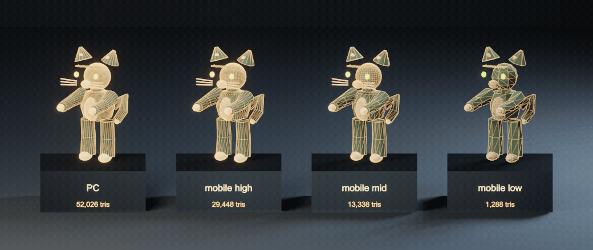
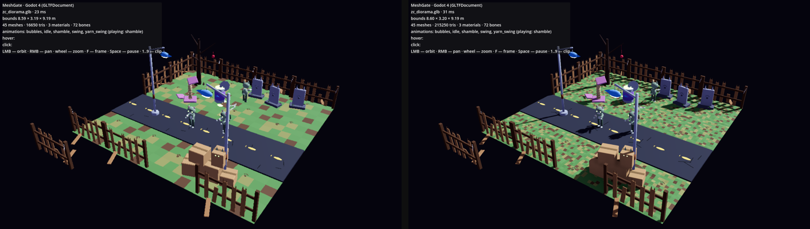

[English](quality-tiers.md) · **Русский**

# Уровни качества: мобильные слабые / средние / мощные и PC

Один пайплайн ассетов, четыре уровня устройств. [`core/profiles.json`](../core/profiles.json) — единственный источник правды; валидатор, аддон Blender, веб-вьюер, Unity, Godot и Unreal читают или зеркалируют его, а `python3 tests/check_profiles.py` падает, если хоть одна копия разошлась.

| Уровень | Устройства | Бюджет ассета (на файл) | Бюджет сцены | Рендер |
|---|---|---|---|---|
| `mobile-low` | бюджетные/старые телефоны, ≤ 3 ГБ ОЗУ | 8k трис, 512 px, 4 МБ текстур, 2 материала, 50 костей, 2 влияния, 2 МБ | 60k трис, 60 draw calls | разрешение 0.75×, без теней, без MSAA, без пост-обработки |
| `mobile-mid` | массовые телефоны, 4–6 ГБ | 25k трис, 1024 px, 12 МБ, 4 материала, 75 костей, 4 влияния, 6 МБ | 150k, 150 | 0.9×, жёсткие тени 1024, MSAA 2× |
| `mobile-high` | флагманы, планшеты, ≥ 8 ГБ | 60k трис, 2048 px, 32 МБ, 8 материалов, 150 костей, 12 МБ | 300k, 300 | полное разрешение, мягкие тени 2048, MSAA 4×, bloom |
| `pc` | десктопы и ноутбуки | 250k трис, 4096 px, 128 МБ, 16 материалов, 256 костей, 25 МБ | 2M, 2000 | полное разрешение, мягкие тени 4096, MSAA 4×, AO, bloom, HDR |

## Бюджет — это цель, а не только потолок

- **Строй под уровень.** Генератор должен тратить бюджет: пак «Коты-зомби» строит те же пропсы с меньшим числом сегментов для `mobile-low` и с большим числом сегментов, сглаживанием и фасками для `pc` (`make_pack_zombie_cats.py --detail/--tiers`) — кот-зомби 1k трис на mobile-low и 52k на PC, вся улица 7k и 172k. Форма остаётся чистой, а не децимированной из одной модели.
- **Или упрощай автоматически.** Аддон Blender (**Уровни качества: Слабые / Средние / Мощные**) и `export_meshgate.py --profiles mobile-low,mobile-mid,mobile-high` пишут `<name>.<уровень>.glb` из любой сцены: DECIMATE, пока не влезет бюджет треугольников (до модификатора арматуры, скины работают), уменьшенные текстуры, ограничение влияний, JPEG там, где нет прозрачности. Исходная сцена не меняется.
- **Канонический `<name>.glb` — это PC-версия**: полное качество, эталон контракта.
- **Проверка.** `python3 core/validate_glb.py asset.glb --profile all` печатает каждую строку бюджета и уровни, в которые файл `fits`; `--scene` берёт бюджет сцены. Превышение — предупреждение (`--strict` делает его ошибкой).
- **Будущая генерация (текст/картинка → 3D)** получит уровень как целевой полигонаж и размер текстур, а затем ту же проверку.

## В рантайме

| Цель | Выбор уровня | Что меняется | Файлы-варианты |
|---|---|---|---|
| Web (`meshgate-viewer.js`) | `quality: "auto"` (десктоп → pc; телефоны по памяти, ядрам, имени GPU) или `?quality=mobile-low`; `setQuality()` | pixel ratio × render scale, тип/размер теней, MSAA; на PC добавляются GTAO и HDR-bloom (порог 1.0: светится только эмиссия) | `load("x.glb")` берёт `x.<уровень>.glb`, если он есть |
| Unity (`MeshGateQuality`) | компонент или `MeshGateQuality.Apply(tier)`; `Auto` отличает телефон от десктопа | QualitySettings (MSAA, тени, дистанция, LOD bias, лимит мипов, анизотропия, скиннинг на 2/4 кости); для URP render scale/MSAA/HDR на рантайм-копии ассета пайплайна | `MeshGateAsset.useQualityVariant` → `LoadedFile` |
| Godot (`MeshGateQuality`) | нода или `MeshGateQuality.apply(tier, viewport)` | MSAA, 3D-масштаб, порог LOD мешей, атлас теней + мягкий фильтр, свет, SSAO, glow | `MeshGateAsset.use_quality_variant` → `loaded_file` |
| Unreal | `meshgate_import.apply_quality(tier)` | масштабируемость `sg.*` 0–3, screen percentage, консольные переменные теней, AO, bloom, MSAA | `import_pack(folder, profile=tier)` |

В тестовых проектах лежат **три сцены одной и той же улицы** — `ZombieCats_Low/_Mid/_PC.unity` в Unity и `demo_pack_low/_mid/_pc.tscn` в Godot — каждая со своими файлами и настройками уровня. Тесты Unity и Godot проверяют, что `mobile-low` берёт вариант в пределах бюджета, а PC грузит детальный канонический файл.

