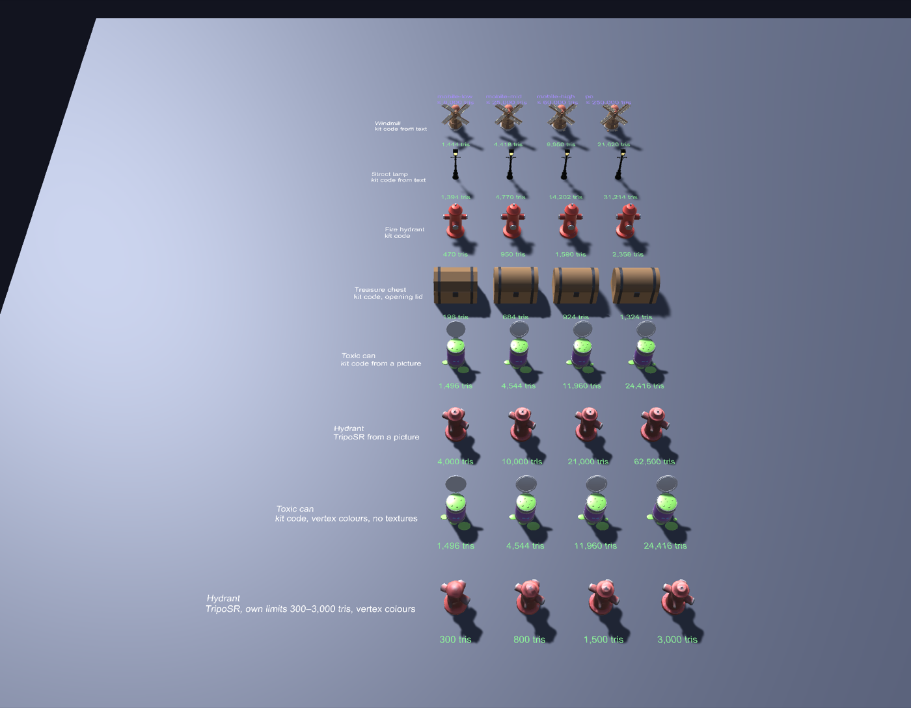

[English](README.md) · **Русский**

# Пример пака: Сгенерированное

Восемь ассетов, сделанных [`meshgate.py gen`](../../../docs/generation.ru.md). Они проходят те же проверки движков, что
и собранные вручную примеры, поэтому каждое изменение генерации проверяется в веб-вьюере, Unity, Godot и Unreal.

| Ассет | Чем сделан | Треугольники, mobile-low → PC |
|---|---|---|
| `gen_windmill` | Код набора, который ИИ написал по русскому описанию, клип вращения `spin` | 1 444 → 21 620 |
| `gen_street_lamp` | Код набора, который ИИ написал по английскому описанию | 1 394 → 31 214 |
| `gen_fire_hydrant` | Пример кода набора вручную, выпуклая коллизия | 470 → 2 358 |
| `gen_treasure_chest` | Пример кода набора вручную, открывающаяся крышка, коллизия-коробка | 196 → 1 324 |
| `gen_toxic_can` | Код набора, который ИИ написал, глядя на картинку банки из пака котов-зомби | 1 496 → 24 416 |
| `gen_hydrant_photo` | Сетка TripoSR по картинке, доведённая под каждый уровень | 4 000 → 62 500 |
| `gen_toxic_can_vertex` | Код набора токсичной банки с `--colors vertex`: без текстур | 1 496 → 24 416 |
| `gen_hydrant_lowpoly` | Гидрант TripoSR с `--tris low=300,mid=800,high=1500,pc=3000 --colors vertex` | 300 → 3 000 |

У каждого ассета есть `<имя>.glb` (PC) и `<имя>.mobile-low/mid/high.glb`; у ассетов с коллизией ещё `.godot.glb`, а
у кода набора — `.unreal.fbx`. `index.json` описывает их в том же виде, что и пак котов-зомби.



## Что проверяется

- **Web:** галерея вьюера показывает пак из `samples/index.json`.
- **Unity:** `GeneratedPackLoadsEveryTier` загружает каждый канонический файл с клипами, высотой и опорой на землю, а
  каждый файл уровня — в пределах его бюджета треугольников.
- **Godot:** `tests/test_meshgate.gd` проверяет каждый синхронизированный пак, включая файлы уровней.
- **Unreal:** `tests/unreal/test_pack_import.py` проверяет, что импортёр выбирает существующий файл для каждого ассета
  и уровня.

## Пересборка

```bash
python3 sources/generate/make_generated_pack.py                  # из закоммиченного кода и выхода TripoSR
python3 sources/generate/make_generated_pack.py --live-triposr   # сначала заново сгенерировать сетку TripoSR
```

Исходники лежат в [`sources/generate/examples`](../../../sources/generate/examples): код сборки, две картинки и сырой
выход TripoSR, поэтому пак пересобирается и на машине без TripoSR.
