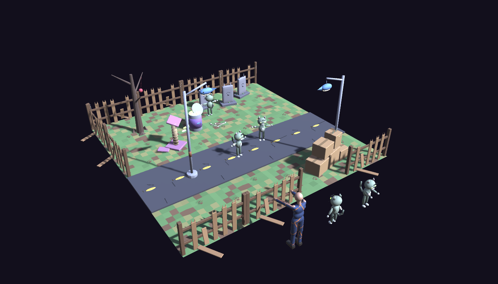
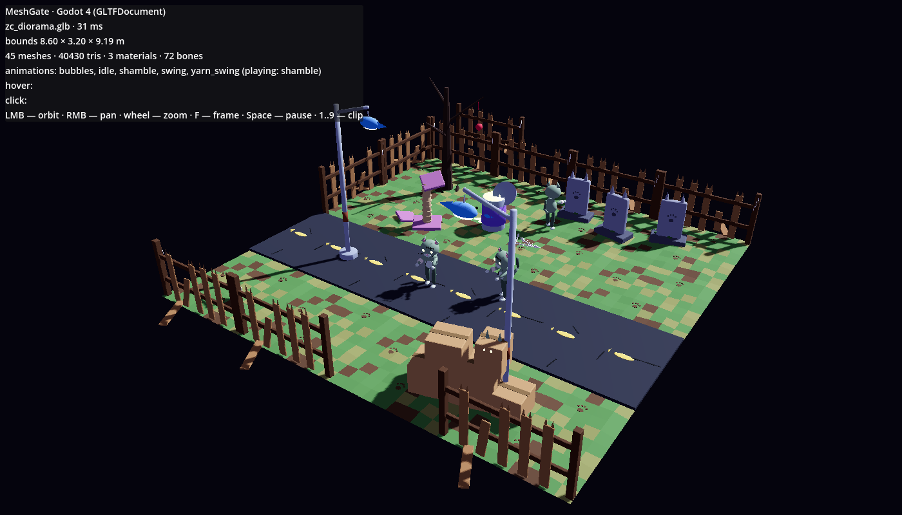

**English** · [Русский](README.ru.md)

# Example pack: Zombie Cats

A cute-apocalypse location kit — 11 assets and a diorama — made from the stylized kit models of the Zombie Cats styles
(the top row of [the styles lineup](../../../docs/img/zc-styles-lineup.jpg), after the concept art) and pushed through
the whole MeshGate pipeline: every quality tier, collision proxies, engine variants, the validator, the web viewer, Unity,
Godot and Unreal. It is both a showcase and a test: `python3 meshgate.py check blender` rebuilds it on every Blender
version, and the Unity and Godot tests load every asset against this `index.json`.



## How it is built

- Each asset is **kit code** (`sources/generate/examples/zombie_cats/stylized/*.py`) built by `meshgate.py gen` at every
  tier: pc is the canonical file, `<name>.mobile-low/mid/high.glb` are built again at that tier's detail — not just
  decimated — and stay within its budget.
- **One palette material** per asset (base colour, roughness-metallic, glow) — one draw call per mesh.
- Every prop stands on its origin at ground level, in meters, with ASCII names.
- Static props carry **collision proxies**: `<name>.unreal.fbx` has `UCX_` meshes, `<name>.godot.glb` has
  `-convcolonly` nodes (Godot turns them into StaticBody3D on import).
- **`zc_zombie_cat`** is rigged on the **Unity Humanoid** skeleton plus tail bones, with clips `idle` and `shamble`.
- **`zc_diorama`** is an 8 × 8 m street of linked duplicates — instanced tiles and fences, three shambling cats,
  lamps, graves, a toxic can; its tier files stay within each tier's scene budget.

## Assets

| File | Asset | Tris, mobile-low → PC | Size, m (X×Y×Z, Y up) | Clips | Bones | Engine variants |
|---|---|---|---|---|---|---|
| `zc_ground_tile.glb` | Ground tile (paw prints) | 1,094 → 5,741 | 2.00×0.05×2.00 | — | — | — |
| `zc_road_tile.glb` | Road tile (fish marks) | 67 → 758 | 2.00×0.11×2.00 | — | — | — |
| `zc_fence_broken.glb` | Broken fence (cat-ear pickets) | 1,354 → 4,943 | 1.95×1.10×0.23 | — | — | zc_fence_broken.unreal.fbx, zc_fence_broken.godot.glb |
| `zc_tombstone_cat.glb` | Cat tombstone | 1,264 → 5,358 | 0.84×1.11×0.58 | — | — | zc_tombstone_cat.unreal.fbx, zc_tombstone_cat.godot.glb |
| `zc_dead_tree.glb` | Dead tree + yarn | 371 → 2,336 | 1.58×2.61×0.89 | yarn_swing | — | zc_dead_tree.unreal.fbx, zc_dead_tree.godot.glb |
| `zc_cardboard_barricade.glb` | Box barricade (hiding cat) | 680 → 8,910 | 1.81×1.33×0.66 | — | — | zc_cardboard_barricade.unreal.fbx, zc_cardboard_barricade.godot.glb |
| `zc_toxic_can.glb` | Toxic cat food can | 3,902 → 14,288 | 0.94×1.30×0.97 | bubbles | — | zc_toxic_can.unreal.fbx, zc_toxic_can.godot.glb |
| `zc_street_lamp.glb` | Fish street lamp | 294 → 8,218 | 0.56×3.15×0.96 | swing | — | zc_street_lamp.unreal.fbx, zc_street_lamp.godot.glb |
| `zc_bones_pile.glb` | Fish bones | 1,506 → 9,996 | 0.67×0.20×0.47 | — | — | — |
| `zc_scratch_post_ruin.glb` | Ruined scratching post | 2,489 → 23,847 | 0.62×1.07×0.56 | — | — | zc_scratch_post_ruin.unreal.fbx, zc_scratch_post_ruin.godot.glb |
| `zc_zombie_cat.glb` | Zombie cat (Humanoid, idle/shamble) | 2,677 → 41,363 | 0.51×1.08×0.62 | idle, shamble | 25 | — |
| `zc_diorama.glb` | Diorama: zombie cat street | 50,190 → 332,387 | 8.00×3.15×8.00 | bubbles, idle, shamble, swing, yarn_swing | 75 | — |

Every asset also has `<name>.fbx` (except the diorama). All files satisfy the contract with `--strict`.

## Rebuild

```bash
python3 sources/generate/make_zombie_cats_pack.py   # every asset through gen, then the diorama
python3 meshgate.py samples                         # rebuilds this pack together with the other samples
```

## Use it

- **Web:** `python3 meshgate.py serve` → the gallery has a "Zombie Cats pack" group.
- **Unity:** `MeshGateSampleTools.BuildAll` copies the pack and builds `Assets/MeshGate/ZombieCatsDemo.unity`; `MeshGateAsset` with `playOnLoad = "shamble"` makes a cat walk at runtime.
- **Godot:** `targets/godot/sync_samples.sh`, then open `demo_pack.tscn` (the diorama with `play_on_load = "shamble"` and the collision fence).
- **Unreal:** `meshgate_import.import_pack("/path/samples/packs/zombie_cats")` — `.unreal.fbx` with UCX for static props, GLB otherwise, the cat as a Skeletal Mesh.


