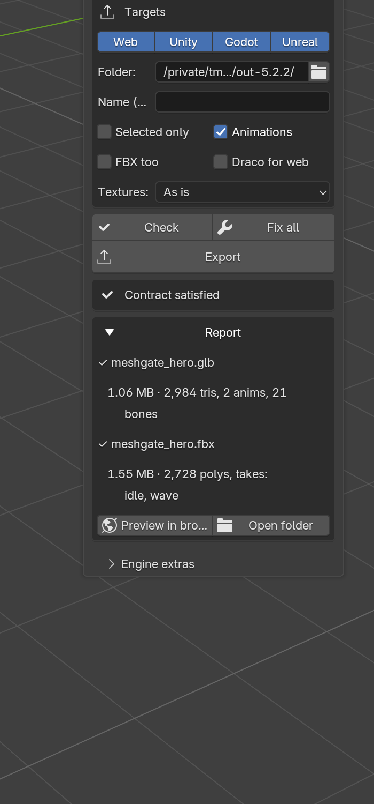
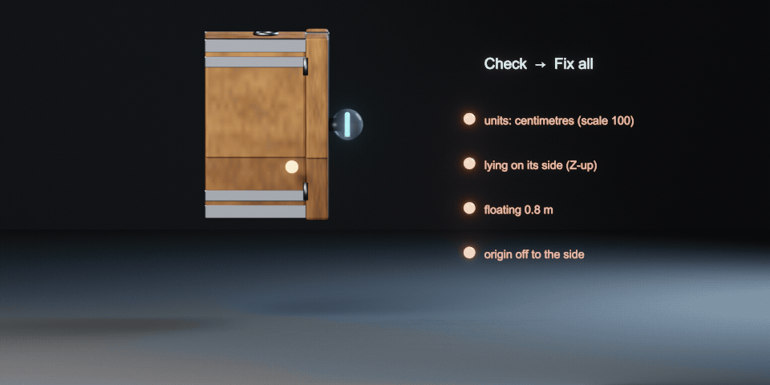

**English** · [Русский](README.ru.md)

# MeshGate for Blender

A Blender add-on that checks your scene against the [asset contract](../../docs/asset-contract.md), fixes what it can with one click, and exports a validated GLB (plus FBX and engine-specific variants) for the web, Unity, Godot and Unreal.

Works in **Blender 3.5 – 5.x** from one zip (tested on 3.5, 4.2 LTS and 5.2 LTS by `python3 meshgate.py check blender`).



## Install

**A. One command** (you have this repository and Python 3):

```bash
python3 meshgate.py install-blender              # builds the zip, installs + enables it in your Blender
python3 meshgate.py install-blender --all        # every Blender on this machine
python3 meshgate.py install-blender --uninstall  # remove it again
```

Close Blender first — a running Blender saves its own preferences on exit and would undo the install. Your `userpref.blend` is backed up next to itself before anything changes. It finds Blender in the usual places; otherwise pass `--blender /path/to/blender` or set `MESHGATE_BLENDER`.

**B. By hand** (just the zip, no Python needed):

1. Download `meshgate-blender-<version>.zip` from the releases page (or build it: `python3 meshgate.py addon` → `dist/`).
2. Blender **4.2+**: drag the zip into the Blender window (or Edit → Preferences → Get Extensions → ⌄ → Install from Disk).
   Blender **3.5–4.1**: Edit → Preferences → Add-ons → Install… → pick the zip → tick **MeshGate**.

Then: 3D View → press **N** → **MeshGate** tab (also File → Export → MeshGate).

Russian UI: Preferences → Interface → Translation → Русский (tick «Interface»).

## Use

1. **Targets.** Toggle Web / Unity / Godot / Unreal. Choose the export folder (`//export/` = next to the .blend) and a name.
2. **Check.** Lists every contract issue: units, size, unapplied or negative scale, names with spaces or Cyrillic, missing UVs or materials, non-PBR materials, missing / external / non-power-of-two / oversized textures, the asset below the ground, a Mixamo/Rigify/UE skeleton that can be renamed to Unity Humanoid, unweighted vertices, loose actions next to NLA clips.
3. **Fix** next to an issue, or **Fix all** (Ctrl+Z undoes it). Fixes: meters, apply scale, transliterate and clean names, Smart UV unwrap, default PBR material, pack textures, resize to a power of two (≤ 4096), put the asset on Z = 0, rename bones to Unity Humanoid, weight stray vertices to the nearest bone and normalize (≤ 4 per vertex), push actions to NLA. Baking procedural materials is the one thing left to you.
4. **Export.** Writes the files below and runs the validator on each; the report appears in the panel. **Preview in browser** serves the folder from Blender on localhost and opens the MeshGate web viewer (needs internet for Three.js from the CDN).



| File | When | For |
|---|---|---|
| `<name>.glb` | always | canonical asset: web, Unity (glTFast), Godot, Unreal (Interchange) |
| `<name>.draco.glb` | Web + «Draco for web» | smaller web download; Godot/Unreal can't read it |
| `<name>.fbx` | «FBX too», Unity or Unreal | engine editors, Unity Humanoid / UE Skeletal Mesh |
| `<name>.unity.fbx` | Unity + LODs in the scene | meshes named `_LOD0.._LODn` → Unity builds a LODGroup |
| `<name>.unreal.fbx` | Unreal + collision in the scene | `UCX_<mesh>_NN` collision → Unreal uses it instead of auto collision |
| `<name>.godot.glb` | Godot + collision in the scene | `<mesh>…-convcolonly` nodes → Godot creates StaticBody3D + convex shape |

**Engine extras** (sub-panel): **Add collision** creates a hidden convex-hull or box proxy for each selected mesh; **Make LODs** creates hidden decimated copies (50 % and 25 %). They never end up in the canonical GLB — only in the variant that needs them.

## Kit panel: build from code, bring in free models

Sidebar (N) → MeshGate → **Kit** puts the generation kit inside Blender:

- **Build from code** — pick a `.py` file with `build(mg)` (written by you or an AI, or one of the
  [examples](../generate/examples)), a tier and a look (palette, low-poly, realistic, clean PBR), press Build. Each build
  gets its own scene, with the same guard rails as `meshgate.py gen`.
- **Free models (CC0 / CC-BY)** — search Sketchfab or Objaverse's hand-labelled categories, then *Download and import*:
  the model comes in at the 3D cursor, in its rest pose, at the size you set, with its author and licence stored on the
  object (`meshgate_credit`). Licences that forbid commercial use or changes are never offered.
- **Scripting** — the kit works on the open scene from the Python console or Text Editor, for you or an AI tool:

```python
from meshgate_blender import kit_ui        # installed from the zip, the package is "meshgate" (≤ 4.1) or "bl_ext.user_default.meshgate"
mg = kit_ui.live_kit("pc")
fur = mg.color("fur", "#7b8a6c", material="fur")
body = mg.blob([{"ball": (0, 0, 0.3), "r": 0.2}, {"ball": (0, -0.18, 0.42), "r": 0.12}], fur)
mg.sculpt(body, "crease", path=[(-0.05, -0.28, 0.45), (0.05, -0.28, 0.45)], radius=0.01, amount=0.005)
kit_ui.live_palette(mg)
```

## Headless (same code)

```bash
blender -b scene.blend -P sources/blender/export_meshgate.py -- --out build/asset.glb \
        --targets web,unity,godot,unreal --fbx --check --fix --validate
python3 meshgate.py export scene.blend --out build/asset.glb --fbx      # the CLI wraps the line above
```

`--check` prints the issues, `--fix` applies every automatic fix before exporting (`--save-fixed out.blend` keeps the result), `--validate` exits 1 if any file fails the contract.

## Develop

- Code: `sources/blender/meshgate_blender/` — `checks.py` (rules + fixes), `export.py` (canonical + variants + validation), `tools.py` (collision, LODs, preview), `ui.py` (panel/operators), `compat.py` (Blender 3.5 → 5.x API differences), `translations.py`.
- Test on every Blender you have: `python3 meshgate.py check blender`. It installs the zip into a throwaway profile per version (your own Blender settings are untouched), plants every problem in a scene, checks that Check finds them and Fix all clears them, exports all variants and looks inside them, and regenerates the demo assets. Put extra Blender builds in `~/.cache/meshgate/blender/` or list them in `MESHGATE_BLENDERS`.
