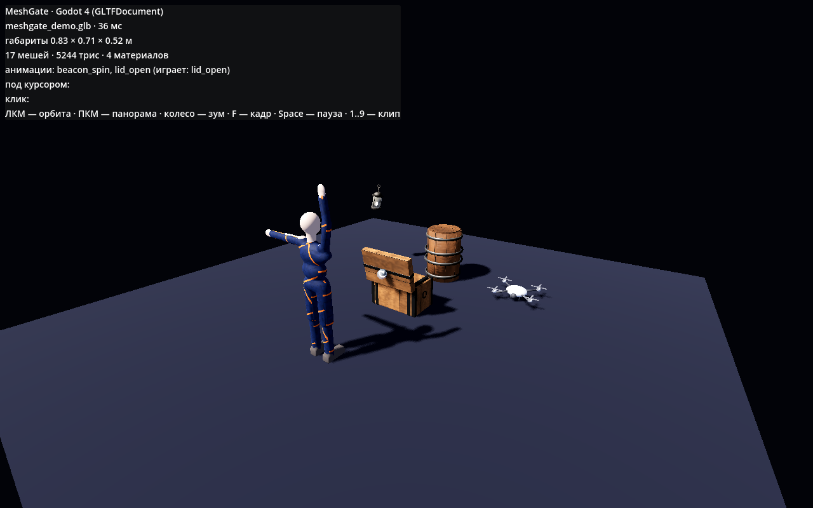
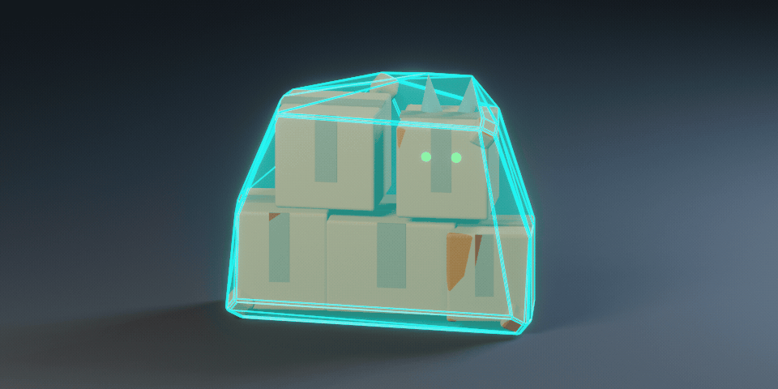

[English](README.md) · **Русский**

# Цель: Godot 4

glTF — родной формат Godot: `.glb` в `res://` импортируется как сцена без плагинов. Поверх этого — наш аддон с тем же API, что у web и Unity, и демо-проект с headless-проверкой.

```
targets/godot/
├── MeshGateDemo/               Godot 4.4+ проект (проверено на 4.7.2, Forward+)
│   ├── addons/meshgate/        аддон: MeshGateAsset, MeshGateOrbitCamera, MeshGateInteraction, MeshGateHud
│   ├── demo.tscn / demo.gd     демо-сцена: все примеры из samples/ в рантайме, свет, пол, орбита, HUD
│   ├── tests/test_meshgate.gd  headless-проверка контракта для каждого GLB
│   └── tests/screenshot.gd     снимок сцены в PNG
└── sync_samples.sh             копирует samples/*.glb репозитория в res://samples/
```



## Быстрый старт

```bash
targets/godot/sync_samples.sh                                   # samples/*.glb → MeshGateDemo/samples/
/Applications/Godot.app/Contents/MacOS/Godot --path targets/godot/MeshGateDemo   # запустить демо (или открыть в редакторе)
```

В своём проекте: скопируй `addons/meshgate/` в `res://addons/`, включи плагин в Project → Plugins, добавь узел **MeshGateAsset**, укажи `source` (`res://`, `user://` или абсолютный путь), на камеру повесь **MeshGateOrbitCamera** с этим ассетом в `target`.

```gdscript
var a := MeshGateAsset.new()
a.source = "res://samples/meshgate_demo.glb"
a.colliders = MeshGateAsset.Colliders.CONVEX
a.loaded.connect(func(asset): asset.solo("lid_open"); print(asset.find("beacon_ring")))
add_child(a)
```

## Headless-проверка

```bash
G=/Applications/Godot.app/Contents/MacOS/Godot
$G --headless --path targets/godot/MeshGateDemo --import                  # первый раз: импорт проекта
$G --headless --path targets/godot/MeshGateDemo -s tests/test_meshgate.gd # контракт: имена, иерархия, габариты, клипы, кости, коллизии
$G --path targets/godot/MeshGateDemo -s tests/screenshot.gd               # снимок → TestResults/meshgate_godot.png (нужно окно)
```

Проверка падает, если у сундука не те ноды/габариты/клипы или крышка не открывается, у hero не 21 кость Unity Humanoid или `wave` не поднимает руку, у пропсов не те ноды и анимации.

## Что даёт аддон

| Узел | Что делает |
|---|---|
| `MeshGateAsset` (Node3D) | Рантайм-загрузка через `GLTFDocument`: иерархия с именами из glTF, `find("crate_lid")`, `bounds` (AABB в метрах), счётчики мешей/трисов/материалов/костей, анимации по именам (`play`, `solo`, `stop`, `set_speed`) через сгенерированный `AnimationPlayer`, коллизии BOX / CONVEX / TRIMESH, сигналы `loaded` / `failed`. |
| `MeshGateInteraction` (Node) | Наведение и клик по нодам через raycast с подсветкой `material_overlay`; сигналы `hover_entered` / `hover_exited` / `clicked`. |
| `MeshGateOrbitCamera` (Camera3D) | ЛКМ — орбита, ПКМ — панорама, колесо — зум, `F` — кадр; сама кадрирует ассет после загрузки. |
| `MeshGateHud` (CanvasLayer) | Паспорт ассета, имя под курсором, `Space` — пауза, `1..9` — выбор клипа. |

## Коллизии



Импортёр редактора превращает каждый узел `<меш>…-convcolonly` из `<имя>.godot.glb` в `StaticBody3D` с этой выпуклой
формой, поэтому статичные предметы сталкиваются сразу после импорта. Во время игры `MeshGateAsset` сам строит коллизии
BOX, CONVEX или TRIMESH.

## Контракт → Godot

- Метры и Y-up совпадают, вперёд у Godot -Z как у glTF — ничего не крутится и не масштабируется.
- Имена нод сохраняются (Godot заменяет только `.`, `:`, `/`, `@`, которых контракт и так не допускает).
- Анимации → `AnimationPlayer` с треками по именам glTF, скины → `Skeleton3D` с костями по именам.
- PBR → `StandardMaterial3D`; `KHR_materials_transmission`/`ior`/`emissive_strength` Godot читает.
- Draco: в Godot 4 нет декодера из коробки — грузите несжатый `.glb`.
- FBX: Godot 4 импортирует через встроенный ufbx, но glTF предпочтительнее и для редактора.
