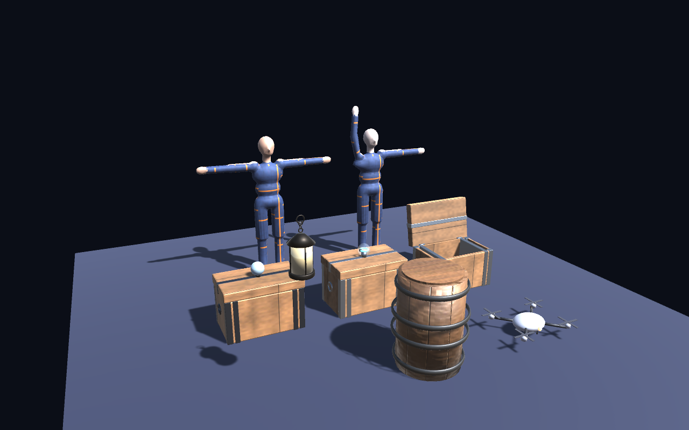
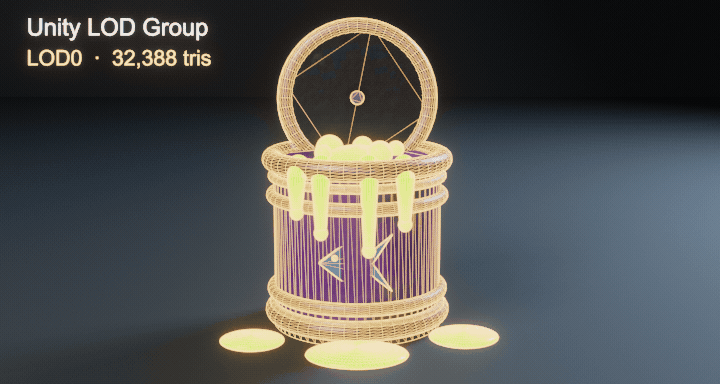
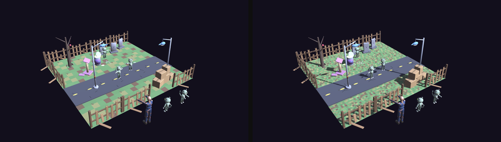

[English](README.md) · **Русский**

# Цель: Unity

Канонический GLB грузится в Unity через **Unity glTFast** (`com.unity.cloud.gltfast`, Apache-2.0) — официальный форк glTFast, который ставится из реестра Unity. Поверх него — наш UPM-пакет и sample-проект.

```
targets/unity/
├── com.meshgate.unity/     UPM-пакет: MeshGateAsset, MeshGateInteraction, MeshGateOrbitCamera, меню валидации
└── MeshGateSample/         Unity-проект (6000.0): демо-сцена, PlayMode-тесты, headless-сборка
```

Требования: Unity **6000.0+** (glTFast 6.20 требует Unity 6). Проверено на 6000.0.80f1, Built-in RP; для URP/HDRP glTFast сам подберёт шейдеры.



## Быстрый старт

**В своём проекте.** Package Manager → Add package from git URL:

```
https://github.com/MaverickGH/meshgate.git?path=targets/unity/com.meshgate.unity
```

Положи `meshgate_demo.glb` в `Assets/StreamingAssets/`, добавь на пустой объект `MeshGateAsset` (source = `meshgate_demo.glb`), на камеру — `MeshGateOrbitCamera` с этим ассетом в поле target. Play — ассет загрузится, камера сама его закадрирует, обе анимации заиграют. `MeshGateInteraction` рядом с `MeshGateAsset` даст наведение/клик по нодам.

**Sample-проект.** Открой `targets/unity/MeshGateSample` в Unity Hub (6000.0.x). Меню **MeshGate → Sample → Build Demo Scene** (в любом проекте с пакетом — **MeshGate → Build Demo Scene (from repo samples)**) скопирует примеры из `samples/` в проект и соберёт `Assets/MeshGate/MeshGateDemo.unity`: слева — FBX (родной импорт Unity), в центре — GLB, импортированный редактором (glTFast ScriptedImporter), справа — тот же GLB, загруженный в рантайме с анимациями, коллайдерами и HUD.

## Headless-проверка (без открытия редактора)

```bash
U=/Applications/Unity/Hub/Editor/6000.0.80f1/Unity.app/Contents/MacOS/Unity   # macOS; в Linux — путь к своему Unity
P=targets/unity/MeshGateSample

# 1. Скопировать демо-GLB и FBX, импортировать редактором, собрать сцену, прогнать валидатор, сверить FBX с GLB
$U -batchmode -nographics -projectPath $P -executeMethod MeshGateSampleTools.BuildAll -quit -logFile -

# 2. PlayMode-тесты: рантайм-загрузка по контракту (иерархия, имена, масштаб 1, метры/Y-up, клипы, крышка открывается)
$U -batchmode -nographics -projectPath $P -runTests -testPlatform PlayMode -testResults $P/TestResults/playmode.xml -logFile -

# 3. Снимок демо-сцены в PNG (нужна графика — без -nographics)
$U -batchmode -projectPath $P -runTests -testPlatform PlayMode -testFilter MeshGateSceneRenderTest -logFile -
open $P/TestResults/meshgate_unity.png
```

Первый запуск разрешает пакеты из реестра Unity (около минуты). Юнит-тесты — `Assets/Tests/PlayMode/`: они же спецификация того, что значит «GLB встал в Unity по контракту».

## Что даёт пакет

| Компонент | Что делает |
|---|---|
| `MeshGateAsset` | Рантайм-загрузка `.glb` (StreamingAssets / абсолютный путь / http): иерархия с именами из glTF, `Find("crate_lid")`, `Bounds` в метрах, счётчики мешей/трисов/материалов, анимации по именам (`Play`, `Solo`, `Stop`, `SetSpeed`), коллайдеры Box / Mesh / MeshConvex, события `onLoaded` / `onFailed`. |
| `MeshGateInteraction` | Наведение и клик по нодам с подсветкой — как во веб-вьюере; события `onHoverEnter` / `onHoverExit` / `onClick`. |
| `MeshGateOrbitCamera` | Орбитальная камера: ЛКМ — орбита, ПКМ — панорама, колесо — зум, `F` — кадр; сама кадрирует ассет после загрузки. |
| `MeshGateQuality` | Уровни качества (mobile-low … pc): настройки рендера уровня и выбор `<имя>.<уровень>.glb` каждым `MeshGateAsset`. |
| `MeshGateTierShowcase` | Каждый ассет пака на каждом уровне рядом, с числом треугольников — сцена примера `GeneratedTiers.unity` показывает так пак генерации. |
| Меню **MeshGate → Validate Selected GLB** | Запускает `core/validate_glb.py` из репозитория и показывает отчёт. |
| Меню **MeshGate → Set Up Humanoid (Selected FBX)** | Вынимает текстуры FBX-персонажа MeshGate и ставит его аватар в Humanoid, чтобы клипы переносились между персонажами. |
| Меню **MeshGate → Parts of Selected Model** | Для модели из частей (`gen --split`, в Studio **«Разделить на части»**): перечисляет части с местом и размером и проверяет, что точка опоры стоит у основания — каждый ящик или доску можно двигать отдельно. В batch-режиме: `-executeMethod MeshGate.Editor.MeshGateParts.ReportFolder -meshgateFolder Assets/MeshGate/<модель>`. **«Отправить в → Unity»** из Studio кладёт файлы в `Assets/MeshGate/<модель>/`. |

Подробности API — в [com.meshgate.unity/README.md](com.meshgate.unity/README.ru.md).

## FBX — запасной путь для редактора

Тот же экспорт умеет выдавать FBX рядом с GLB: `--fbx` в `export_meshgate.py`. Настройки под Unity/Unreal: метры (`UnitScaleFactor = 100` → File Scale 1, масштаб объектов 1), `-Z forward / Y up`, сглаживание по граням, тангенты, каждый NLA-стрип — отдельный take, текстуры встроены. Проверка — `core/validate_fbx.py`.

| | GLB (канон) | FBX (запасной) |
|---|---|---|
| Импорт в редакторе | glTFast ScriptedImporter | родной Unity, без пакетов |
| Загрузка в рантайме | да (`MeshGateAsset`) | нет — FBX SDK только в редакторе |
| Материалы | PBR как есть (metallic/roughness-карты, эмиссия, прозрачность) | Phong → наш постпроцессор `MeshGateFbxMaterials` переводит в Standard/URP Lit: альбедо, normal, эмиссия, metallic (ReflectionFactor), smoothness (√(ShininessExponent/100)); roughness-карта и прозрачность **теряются** |
| Анимации | Legacy-клипы по именам / Mecanim | Mecanim (Generic/Humanoid) — родной путь для ригов |
| Веб / Godot | тот же файл | нет |

Unity держит встроенные в FBX текстуры «внутри» и не подставляет их в материалы, пока их не извлечь (кнопка **Extract Textures** в импортёре или `ModelImporter.ExtractTextures`) — `BuildAll` делает это сам. `BuildAll` также сверяет FBX с GLB: одинаковые иерархия, габариты, масштаб 1 и клипы — иначе сборка падает.

Правило: **редактору и ригам — FBX, рантайму/вебу/PBR — GLB.** Оба выходят из одного `.blend` одной командой.

## Что видно без Play, а что только в Play

| Объект в сцене | Как загружен | Виден в редакторе |
|---|---|---|
| `MeshGate Asset (FBX import)`, `MeshGate Prop FBX (…)`, `MeshGate Hero (FBX Humanoid)` | родной импорт FBX редактором | да |
| `MeshGate Asset (editor import)` | GLB через glTFast ScriptedImporter | да |
| `MeshGate Asset (runtime)`, `MeshGate Hero (runtime)` | `MeshGateAsset` из StreamingAssets | **только в Play** — в редакторе это пустой узел |

Поэтому ряд пропсов (фонарь, бочка, дрон) стоит как FBX-импорт (каждый внутри пустого родителя: Blender-FBX бэйкает ключи и на корневой объект, и Animator в Play перезапишет позицию корня), а рантайм-загрузку показывают сундук и hero; те же GLB пропсов проверяются в PlayMode-тестах.

## Персонажи: Humanoid и ретаргет

Демо-сцена ставит позади сундуков `meshgate_hero`: слева FBX, который `BuildAll` переключает в **Mecanim Humanoid** (`animationType = Human`, аватар из модели — кости названы по Unity Humanoid, поэтому маппинг автоматический; `Verify` падает, если аватар невалиден или сопоставлено меньше 15 костей), справа тот же GLB в рантайме через glTFast (скин, 21 кость, Legacy-клипы `idle`/`wave`). Humanoid-клип `wave` из FBX работает на любом другом Humanoid-аватаре — так в `My project` он анимирует реалистичный аватар (ретаргет Mecanim).

Свой персонаж: прогнать через `sources/blender/animate_humanoid.py` (см. `samples/README.md`) — он найдёт кости Mixamo/Rigify/UE и выдаст GLB + FBX по контракту.

## Уровни качества и LOD



Два способа держать сцену лёгкой. Во время игры **MeshGateQuality** на сцене заставляет каждый `MeshGateAsset` грузить
`<имя>.<уровень>.glb` для выбранного уровня. В редакторе `<имя>.unity.fbx` несёт меши `_LOD0…_LODn`, и Unity собирает
LOD Group, которая меняет их по расстоянию, как выше.



## Контракт → Unity: что важно знать

- **Метры и Y-up** совпадают с Unity. glTF правосторонний, Unity левосторонний — glTFast зеркалит по X; имена, иерархия и масштаб 1 сохраняются (тест проверяет `localScale == 1` у всех нод).
- **Origin в основании** → `Bounds.min.y == 0`: ассет можно ставить на пол без подгонки.
- **PBR** → шейдеры glTFast (`glTF/PbrMetallicRoughness` или URP/HDRP-варианты). Эмиссия с `KHR_materials_emissive_strength` и прозрачность (`BLEND`) переносятся.
- **Анимации** → Legacy `Animation`, клип = имя анимации glTF; каждый клип на своём слое, чтобы играть одновременно. Для Mecanim — `ImportSettings.AnimationMethod = Mecanim` и свой контроллер.
- **Draco / KTX2 / meshopt** — нужны пакеты `com.unity.cloud.draco`, `com.unity.cloud.ktx`, `com.unity.meshopt.decompress`; без них грузите `meshgate_demo.glb`, а не `.draco.glb`.
- Импорт в редакторе (`.glb` в `Assets/`) — тот же glTFast: получается ассет-префаб с той же иерархией и клипами как саб-ассетами.

Ограничения: `MeshGateInteraction` и `MeshGateOrbitCamera` используют старый Input Manager (`ENABLE_LEGACY_INPUT_MANAGER`); при активном только новом Input System они молчат — подключите свой ввод к их публичным методам.
