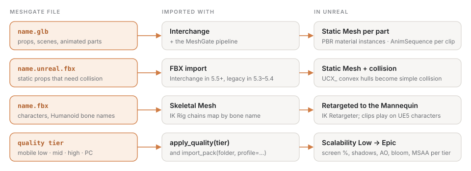

**English** · [Русский](README.ru.md)

# Target: Unreal Engine 5

Unreal takes the canonical GLB through **Interchange** (UE 5.3+) and FBX through Interchange (default since 5.5) or the legacy FBX importer; for runtime loading there is the third-party **glTFRuntime** plugin (MIT). Our part is the content-only `MeshGate` plugin with editor Python scripts, plus the Unreal-specific asset preparation in the Blender add-on.

> **Status: checked against the Unreal Python API, not yet run in a live editor.** Unreal is not installed on the development machine. Instead, `python3 meshgate.py check unreal` checks every `unreal.*` class, method, enum value, constructor keyword and editor property the plugin uses against the API stubs Unreal itself generates for **UE 5.4, 5.5 and 5.6** (public [`unreal-stub`](https://pypi.org/project/unreal-stub/) package). Reviewing the first version against these stubs and Epic's docs found a dozen bugs — a dialog function that does not exist, the hero spawned upside down (`Rotator` is roll, pitch, yaw), a reference-pose setting that contradicted the contract, FBX options that UE 5.5+ ignores; they are fixed, and the check keeps that class of error from coming back. What it cannot prove is behaviour — the first live run is still on the roadmap. The asset side (meters, axes, names, PBR, skeleton, UCX collision) is verified by the validator, the Blender add-on test on three Blender versions, and the Unity and Godot targets.

```
targets/unreal/MeshGate/
├── MeshGate.uplugin                       content-only plugin (PythonScriptPlugin, Interchange)
├── Content/Python/init_unreal.py          Tools → MeshGate menu
├── Content/Python/meshgate_import.py      import (Interchange / legacy FBX), demo level, validator
└── Content/Python/meshgate_retarget.md    Humanoid → UE5 Mannequin via IK Rig / IK Retargeter
tests/unreal/check_api.py                  the API check (no Unreal needed)
```



## Prepare the asset in Blender

In the MeshGate add-on panel tick **Unreal**. For precise collision select meshes and press **Engine extras → Add collision** (convex hull or box). Export then writes:

- `<name>.glb` — for Interchange (PBR materials, animations, skeletons);
- `<name>.fbx` — for Skeletal Meshes and editors that prefer FBX;
- `<name>.unreal.fbx` — when collision proxies exist: meshes named `UCX_<Mesh>_NN`, **parented to their render mesh** (UE 5.5 Interchange otherwise imports UCX meshes as visible geometry, UE-239476).


## Install

Copy `targets/unreal/MeshGate` to `<Project>/Plugins/MeshGate`, enable **Python Editor Script Plugin** and **Interchange** (on by default in 5.3+), restart the editor. Tools → MeshGate appears.

## Use

```python
# Editor Python console (Window → Output Log → Cmd: Python)
import meshgate_import
meshgate_import.import_samples("/Users/you/meshgate/samples")   # or set MESHGATE_SAMPLES; the menu uses it too
meshgate_import.build_demo_level()                              # /Game/MeshGate/MeshGateDemo, re-runnable
meshgate_import.import_file("/path/asset.glb", "/Game/Props/Asset", skeletal=False)
```

Headless (the `pythonscript` commandlet does not load levels, so use `-ExecutePythonScript`):

```bash
UnrealEditor-Cmd Project.uproject -ExecutePythonScript="Plugins/MeshGate/Content/Python/meshgate_import.py --samples /path/samples --level"
```

What the importer does:

| Source | UE 5.3–5.4 | UE 5.5+ |
|---|---|---|
| `.glb` | Interchange with a MeshGate pipeline | same |
| `.fbx` / `.unreal.fbx` | legacy FBX importer (`FbxImportUI`) unless `Interchange.FeatureFlags.Import.FBX` is on | Interchange with the MeshGate pipeline |

The MeshGate pipeline is Epic's default assets pipeline duplicated per import with: meshes kept separate (`combine_static_meshes = False`), UCX/UBX/UCP/USP collision by name, auto collision otherwise, bind pose as reference pose (`use_t0_as_ref_pose = False` — the contract's rest pose is the T-pose, frame 0 is an animation frame), animations, materials and textures on; skeletal forced for characters, animated props detected as rigid skeletal meshes. Property names that moved between releases (`collision` 5.5+ vs `import_collision` 5.3/5.4) are set by whichever exists. Every source file goes through the MeshGate validator first, run with the editor's own Python.

`build_demo_level()` opens the level if it exists (otherwise creates it), adds a sun and a sky light once, replaces previously placed MeshGate actors, and spawns every imported sample in the same layout as web/Unity/Godot; the hero faces the camera (`Rotator(roll=0, pitch=0, yaw=180)`).

## Contract → Unreal: what to know

- **Units.** UE is centimeters, Z-up, left-handed. Interchange and the FBX importer convert meters → cm and Y-up → Z-up; our FBX writes `UnitScaleFactor = 100`, so "Import Uniform Scale" stays 1.0. `LAYOUT` in the script is in centimeters.
- **Hierarchy.** Meshes are not combined, so `crate_lid` stays its own Static Mesh. `import_asset` creates assets only; placing a whole scene with actors is `import_scene` (not used yet).
- **Materials.** GLB → Interchange gives PBR material instances (metallic/roughness maps, emission, transparency). FBX → albedo/normal/emissive only (see `docs/asset-contract.md`).
- **Animations.** `AnimSequence` per clip name (`lid_open`, `wave` …). A clip spanning several objects (the drone's `rotors`) is several takes in FBX — use the GLB.
- **Humanoid.** Unity Humanoid bone names → IK Rig chains map by name; retargeting to the UE5 Mannequin — `meshgate_retarget.md`.
- **LODs.** Unreal builds LODs itself (LOD Group on import). The add-on's `_LODn` meshes are for Unity only; UE reads LODs only from FBX LOD Group nodes, which Blender does not write.
- **Draco / KTX2** — Interchange does not read them; use the uncompressed GLB.

## Runtime: glTFRuntime

Loading a GLB in a packaged game — [glTFRuntime](https://github.com/rdeioris/glTFRuntime) (MIT, Fab/GitHub). Blueprint recipe:

1. `glTFLoadAssetFromFilename` (package `Content/MeshGate/*.glb` as "Additional Non-Asset Directories").
2. `Load Static Mesh by Name` for props (`crate_body`, `barrel_body`), or `Get Nodes` → for each node `Load Static Mesh` + `Spawn Actor` with `Node Transform` — keeps hierarchy and names per the contract.
3. Characters: `Load Skeletal Mesh Recursive` (`hero_body`) → `Load Skeletal Animation by Name` (`wave`) → `Play Animation`.
4. Hover/click — `LineTraceByChannel` from the camera; highlight — `Set Render Custom Depth` + a post-process material.

A C++ `MeshGateAsset` on top of glTFRuntime, matching the Unity/Godot API, comes after the first live run.
