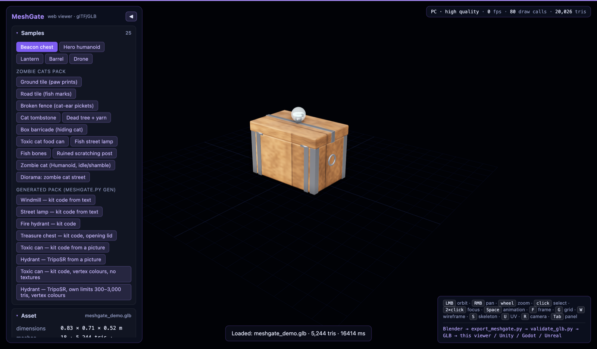

[English](README.md) · **Русский**

# Цель: Web (Three.js)

Веб-рантайм канонического GLB. Два слоя:



| Файл | Что это |
|---|---|
| `meshgate-viewer.js` | **Библиотека** без UI: сцена, свет, окружение, загрузка GLB (Draco / KTX2 / meshopt), интерактив, анимации, drag-and-drop. Встраивается в любой сайт. |
| `index.html` + `app.js` | **Демо-страница** — референс метода: панель с паспортом ассета, дерево объектов, анимации, настройки вида, загрузка своих файлов. |
| `serve.py` | Локальный статический сервер (stdlib), отдаёт корень репозитория, чтобы `/samples/*.glb` были доступны. |

Зависимость одна — Three.js (MIT) с CDN через import map; декодеры Draco/Basis тоже берутся с CDN Three.js. Для офлайна скопируйте `three@0.169.0` локально и поправьте import map в `index.html`.

## Запуск

```bash
python3 targets/web/serve.py                       # http://localhost:8770/targets/web/ → samples/meshgate_demo.glb
python3 targets/web/serve.py --glb samples/my.glb  # открыть другой ассет
```

Параметры URL: `?glb=<url>` — ассет; `&hdr=<url .hdr>` — HDRI-окружение (например, `https://raw.githubusercontent.com/mrdoob/three.js/r169/examples/textures/equirectangular/royal_esplanade_1k.hdr`; сервер должен отдавать CORS); `&env=none` — без окружения; `&autoplay=0` — не запускать анимации.

## Что умеет демо-страница

- **Навигация**: ЛКМ — орбита, ПКМ — панорама, колесо — зум. Инерция и плавный подлёт камеры.
- **Интерактив**: наведение подсвечивает объект и показывает имя; клик — выделение с паспортом (путь в иерархии, габариты, трисы, материал, наличие UV/нормалей); двойной клик — фокус камеры на объекте. Дерево объектов синхронизировано с выделением.
- **Анимации**: список клипов из GLB, соло-режим, пауза/стоп, таймлайн со скрабом, скорость, цикл. `Space` — пауза.
- **Окружение**: студийное `RoomEnvironment` (без внешних файлов) или HDRI по URL / перетаскиванием `.hdr`; HDRI можно включить фоном. Тональное отображение ACES, регулируемая экспозиция.
- **Свет и тени**: небо + ключевой направленный свет с мягкими тенями на невидимом «ловце теней» под ассетом. Сетка выставляется на низ ассета.
- **Draco** (`KHR_draco_mesh_compression`), **KTX2/Basis** (`KHR_texture_basisu`), **meshopt** (`EXT_meshopt_compression`) — декодируются прозрачно.
- **Загрузка своих ассетов**: URL, выбор файла или drag-and-drop `.glb`/`.gltf`/`.hdr` на страницу.
- **Риг**: скелет-хелпер (`S`), **UV-шахматка** (`U`) — подменяет материалы клетчатой текстурой, чтобы оценить развёртку; в паспорте — число костей и мешей без UV.
- **Прочее**: каркас (`W`), сетка (`G`), сброс камеры (`R`), скриншот PNG, счётчик fps / draw calls / треугольников, панель скрывается по `Tab`.

## Встраивание библиотеки

```html
<script type="importmap">
{ "imports": {
  "three": "https://cdn.jsdelivr.net/npm/three@0.169.0/build/three.module.js",
  "three/addons/": "https://cdn.jsdelivr.net/npm/three@0.169.0/examples/jsm/"
} }
</script>
<div id="viewer" style="width:100%;height:480px"></div>
<script type="module">
  import { createViewer } from "./meshgate-viewer.js";
  const v = createViewer(document.getElementById("viewer"), { environment: "room", grid: false });
  const info = await v.load("/assets/chest.glb");          // { dims, triangles, materials, animations, extensions, ... }
  v.on("select", ({ object }) => console.log("выбрано:", object?.name));
  v.animations.solo("lid_open");                            // играть только один клип
  v.frame(v.asset.root.getObjectByName("beacon_ring"));     // подлететь к объекту
</script>
```

### API `createViewer(container, options)`

Опции: `background` (цвет), `accent`, `grid`, `shadows`, `environment` (`"room" | "none" | url.hdr`), `showEnvironment`, `exposure`, `autoplay`, `dracoPath`, `ktx2Path`, `dropTarget`.

| Метод / поле | Назначение |
|---|---|
| `load(urlOrFile)` → `Promise<info>` | Загрузить GLB, заменив текущий. `info` — паспорт ассета. |
| `unload()` | Убрать ассет и освободить GPU-ресурсы. |
| `frame(object?)`, `resetView()` | Кадрировать объект (по умолчанию весь ассет) / сбросить камеру. |
| `select(object)`, `hover(object)`, `describeObject(object)` | Управлять выделением из своего UI. |
| `animations.play(name?) / pause() / toggle() / stop() / solo(name) / setTime(s) / setSpeed(k) / setLoop(bool)`, `animations.clips`, `animations.state` | Анимации. |
| `setEnvironment(mode)`, `setShowEnvironment(bool)`, `setBackgroundColor(hex)`, `setExposure(v)` | Окружение и тон. |
| `setGrid(bool)`, `setShadows(bool)`, `setWireframe(bool)`, `setSkeleton(bool)`, `setUvChecker(bool)` | Вид. |
| `screenshot(type?)` → dataURL | Снимок текущего кадра. |
| `on(event, cb)` / `off(event, cb)` | События: `loadstart`, `progress`, `load`, `error`, `select`, `hover`, `frame`, `animation`, `tick`, `stats`, `drag`. |
| `asset`, `selected`, `hovered`, `stats`, `environmentMode`, `scene`, `camera`, `renderer`, `controls`, `THREE` | Доступ к внутренностям для расширения. |
| `dispose()` | Полностью остановить и убрать вьюер. |

## Ограничения

- Y-up и метры вьюер не проверяет (из файла это не видно) — это делает контракт на стороне экспорта и `core/validate_glb.py`.
- `KHR_materials_*` расширения рендерятся так, как их поддерживает Three.js данной версии.
